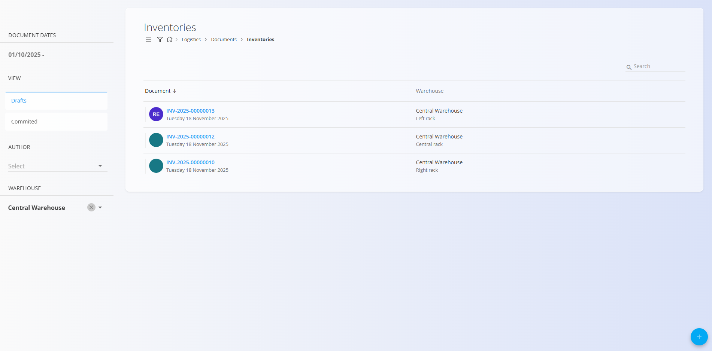
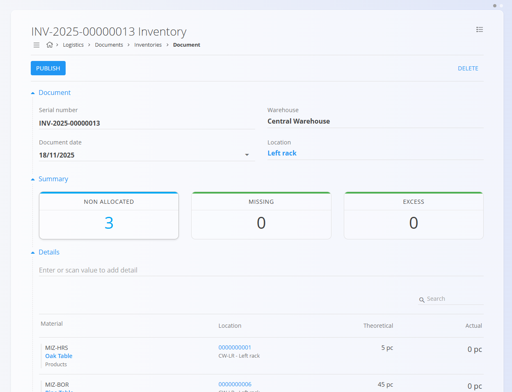
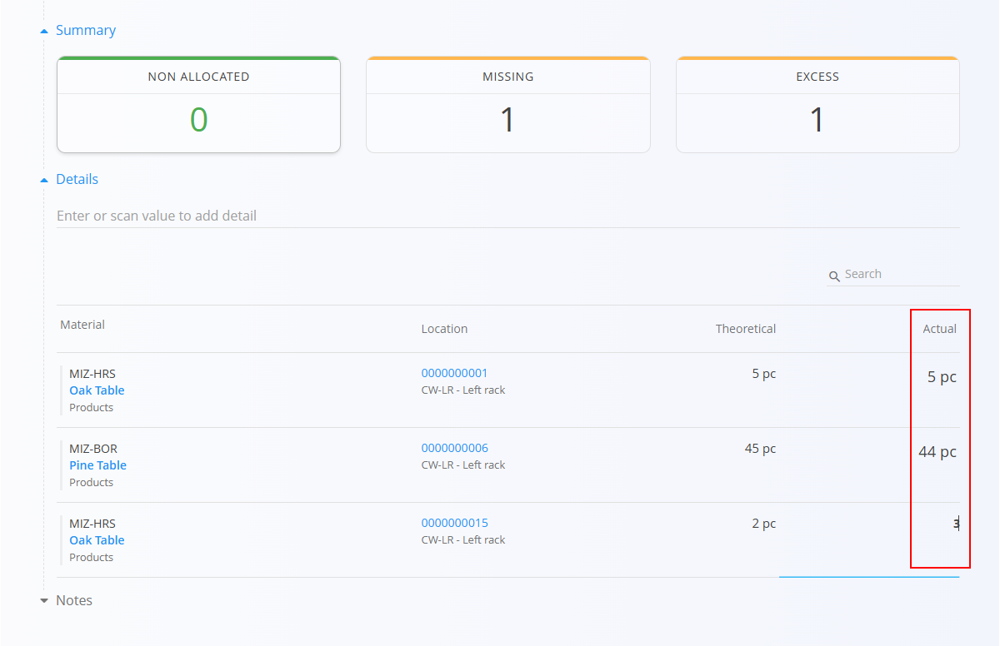

# Inventories

An **Inventory** document is used to verify and correct stock quantities at a specific warehouse location. It helps you compare **theoretical stock** (what the system expects) with **actual stock** (what is physically present). Any discrepancy—missing or excess—is resolved by publishing the document.

For a full walkthrough of how inventory checks work, watch the  
[Inventory](https://www.youtube.com/watch?v=Rc4qqTdxKn8) video.

To access Inventories, go to **Logistics / Documents / Inventories** in the navigation.

---

## Schema

### Document section

| Field | Description |
|-------|-------------|
| **Serial number** | System-generated unique identifier for the inventory document. |
| **Document date** | Date when the inventory count is performed or recorded. |
| **Warehouse** | Warehouse where the inventory verification is taking place. |
| **Location** | Specific location within the selected warehouse that is being verified. |

### Detail section

| Field | Description |
|-------|-------------|
| **Material** | The material stored at the selected location. |
| **Location** | Storage location where the inventory is being performed. |
| **Theoretical** | Quantity currently recorded in the system. |
| **Actual** | Physically verified quantity (editable). |

---

## List of inventory documents

The **Inventories** page displays all inventory documents.  
You can filter the list using the left sidebar, which includes:

- **Document dates**
- **View**  
  - *Drafts* — documents created but not yet published  
  - *Committed* — published inventory adjustments
- **Author**
- **Warehouse**

A color indicator next to each document shows its status:

- **Green** — committed  
- **Gray** — draft

Click any document to open and review its contents.

**List view example:**

---

## Actions

Click the **action button** to create a new inventory document.

### Creating an inventory document

1. Click **Add new** to create a new inventory session.  
   

2. After selecting a warehouse and location, the system automatically loads all materials recorded at that location.

3. In the **Summary** section, you will see:  
   - **Non allocated** — number of materials that still need to be verified  
   - **Missing** — number of materials with lower actual than theoretical  
   - **Excess** — number of materials with higher actual than theoretical

4. In the **Details** section, the **Actual** column shows **0** by default. Edit the values in this column to reflect the real number found physically at the location.

   

5. Once all adjustments are made, click **Publish** to confirm the inventory. This action updates the system stock levels to match the actual physical quantities.

A newly created inventory document appears in **Drafts**. Once published, it moves to **Committed** and stock levels are corrected.

---

## Menu

Inside an inventory document, the **menu (hamburger icon)** provides the following options:

- **Printing**
- **Exporting (PDF)**  

These options are available for both *draft* and *committed* documents.

---

## Notes

Use the **Notes** section to record any comments related to the inventory process.

---

## Deletion

Click **Delete** to remove a **draft** inventory document. Committed inventory documents **cannot** be deleted.
