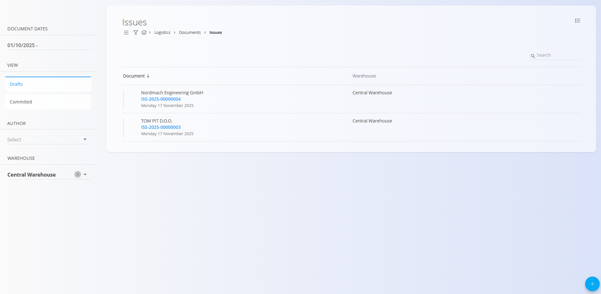

# Issues

An **Issue** document is used to record materials being taken *out* of your warehouse.  
It tracks which items were issued, in what quantities, and to which customer.

For a full walkthrough, watch the  
[Issue](https://www.youtube.com/watch?v=SrVyblBiLmQ) video.

To access Issues, go to **Logistics / Documents / Issues** in the navigation.

---

## Schema

### Document section

| Field | Description |
|-------|-------------|
| **Code** | System-generated unique identifier for the issue document. |
| **Document date** | Date when the goods were issued. |
| **Warehouse** | Warehouse from which the materials are issued. |
| **Customer** | Customer receiving the goods. |
| **Notes** | Additional remarks related to the document. |

---

### Detail section

| Field | Description |
|-------|-------------|
| **Material** | Material being issued (product, semi product, raw material, or repro). |
| **Serial number** | Selected serial number of the material being issued. |
| **Best before** | Expiration date (if the material has shelf life). |
| **Warehouse location** | Current storage location of the selected item. |
| **Quantity (pc)** | Quantity being issued. This is the only editable field. |

---

## List of issue documents

The Issues page displays all issue documents. You can filter the list using the left sidebar, which includes:

- **Document dates**
- **View:**  
  - *Drafts* — documents not yet published  
  - *Committed* — published and finalized documents
- **Author**
- **Warehouse**

A color indicator next to each document shows its status:

- **Green** — committed  
- **Gray** — draft

You can click any document to open and review its details.

---

## Actions

Click the **action button** to create a new issue document.

### Creating an issue document

1. Click the **action button**, then select the **Warehouse** and **Customer**.

2. Type or scan a **serial number**, **EAN**, or **material name** into the Details bar.  
   - The system displays **all matching materials and serial numbers**.  
3. Select the correct material from the results list.  
4. The system automatically fills in all known details (material, serial number, location, best-before).  
 
5. Enter the **quantity** you want to issue — this is the only editable field.  
6. Click **Save** to add the line to the document.  
7. Repeat as needed to add more items.  
8. Click **Publish** to commit the document.

---

## Attachments

At the top of every document, an **Attachments** section is available. 

You can upload any relevant file—such as delivery notes, transport documents, photos, or supporting records. All attached files remain stored together with the document and can be reviewed at any time.

---

## Menu

Inside an issue document, the **menu (hamburger icon)** in the top-right corner shows different options depending on the document status.

### Draft issue document
- Print  
- Export (PDF)  
- Delete all fields  

### Published issue document
- Print  
- Export (PDF)  
- Create a new reversal

---

## Reviewing an issue document

When you click an issue document:

- You see the **Document** section (header information)  
- You see all **Details** representing the issued items  
- You can edit documents in **Draft** status  
- You can also print or export the document
- Published (Committed) documents are read-only except for reversal creation

---

## Deletion

Click **Delete** to delete an issue document draft. Published issue documents cannot be deleted — only a reversal can be created.

