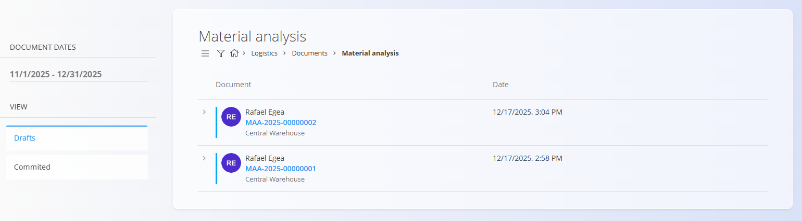
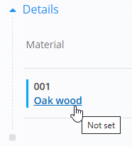
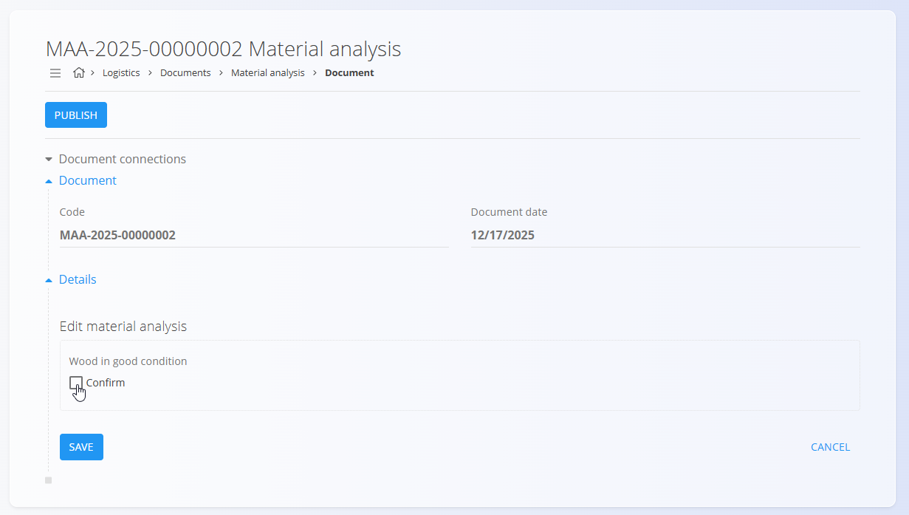
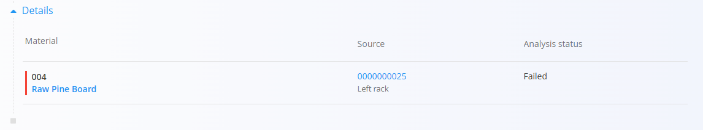

# Material analysis

Material analysis documents list the materials that were received and require analysis or testing based on rules configured in **[Material analysis management](../CodeLists/MaterialAnalysisManagement.md)**. Use this screen to review the required checks, mark materials as passed, and publish the results.

> [!NOTE]
> Material analysis documents are created automatically when receiving materials that have an analysis configured in **Material analysis management**.

> [!TIP]
> For a full demonstration, see the **[Material analysis](https://www.youtube.com/watch?v=aJhceUVcusw)** video

To access **Material analysis**, go to **Logistics / Documents / Material analysis** in the [navigation](../../Common/UI/Navigation.md).

## Schema

| Field | Description |
|-------|-------------|
| [**Code**](../../Common/UI/DocumentCodes.md) | System‑generated identifier of the material analysis document. |
| **Document date** | Date when the analysis document was created. |
| [**Material**](../../Assets/Domain/Materials.md) | The material under analysis (as defined by the receipt and analysis configuration). |
| **Source** | Serial number of the material received. |
| **Status** | Analysis status: **Not set**, **Passed**, or **Failed**. |

## List view

The list shows all material analysis documents created during receiving for materials with configured analyses. Use search or filters to locate entries by status.

## Reviewing and passing an analysis

1. Click a document in the draft list to open it.
   
   

2. Click the **Material** field to select the material to test (if multiple are listed).
   
   

3. Click the **Check** button to pass the test for the selected material and click **Save**. The **Status** changes to **Passed** and the material shows green color on the list.
   
   

   - If the test is not passed, leave the check unmarked and click **Save**. The status changes to **Failed** and the material shows red color on the list. 
    
     

4. Once all required checks are complete, click **Publish** to finalize the material analysis document. The document moves to the Committed list.
 
## Deletion

Material analysis documents cannot be deleted.

---
