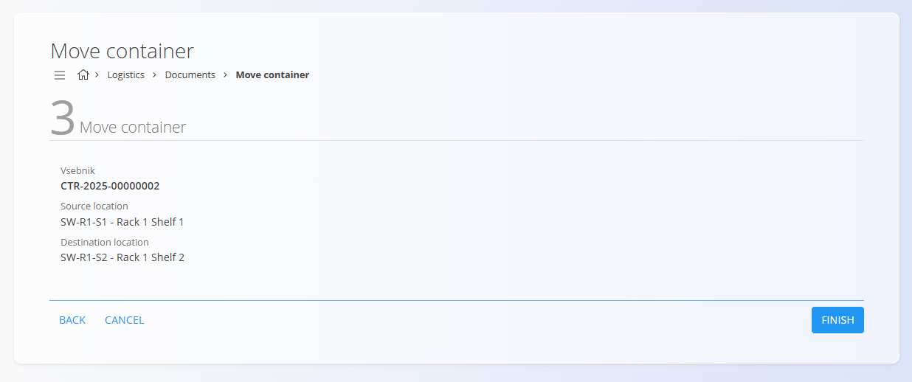

# Move container

The Move container screen is a streamlined workflow to relocate a single container from one warehouse location to another. It is designed for fast operations (scan and confirm) without using document lists or an action button.

This flow mirrors [**Move serial**](MoveSerial.md) but applies to containers (e.g., pallets or boxes) that hold one or more materials.

> [!NOTE]
> Moving a container updates inventory by moving all items inside the container from the source location to the destination location.

> [!TIP]
> For a full demonstration, see the **[Move container](https://www.youtube.com/watch?v=r_H76lJd7XY)** video tutorial.

To access **Move container**, go to **Logistics / Documents / Move container** in the [**navigation**](../../Common/UI/Navigation.md).

### Prerequisites

- Define warehouse **[Locations](../Management/Locations.md)**.
- Ensure the [**container**](Containers.md) is registered and has a scannable identifier (barcode/EAN/code).

## Steps

### Step 1 — Identify the container

Scan the container barcode or type the **Container** code. The UI shows container info and its current location.

- If multiple matches are found, select the correct container.
- If the current location is unknown, you can set it manually.

### Step 2 — Select destination

Choose the **To location**. You can:
- Scan the destination location label, or
- Enter the location manually.

> [!TIP]
> - Use standardized location labels to speed up scanning.
> - Verify the location’s availability if your process enforces capacity rules. See **[Stock boundaries](../Management/StockBoundaries.md)** for details.

### Step 3 — Confirm the move

Review the summary (container, from/to locations) and click **Finish**. The system records the transfer of the container and all contained items.

After confirmation:
- The container’s location changes to the destination.
- All items inside the container are shown at the destination in stock views.
- All details can be reviewed in the **[Inter warehouse](InterWarehouse.md)** page.

