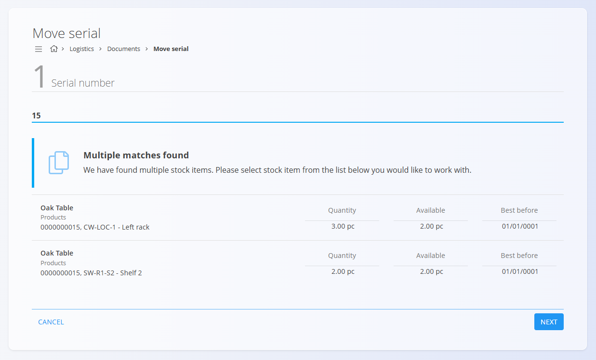
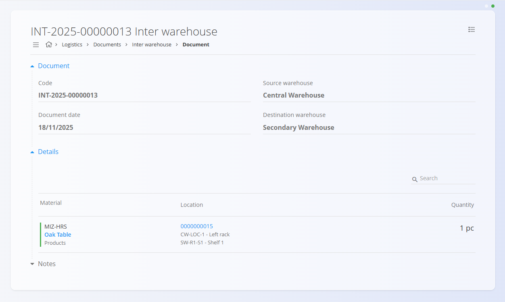

# Move serial

The **Move serial** function allows you to quickly move a specific stock unit (identified by its serial number) from one storage location to another. It is designed for fast, frequent movements on the warehouse floor—for example, reorganizing shelves, preparing goods for picking, or correcting misplaced items. Unlike a full **[Inter warehouse](InterWarehouse.md)** document, Move serial focuses only on relocating a single serial-numbered unit within the warehouse structure.

You can open the [**Stock view by material**](Stock.md#stock-view-by-material) or [**Stock view by serial number**](Stock.md#stock-view-by-material) from related screens to better understand where the item is currently stored and how it has been moved in the past.

> [!TIP]
> For a full demonstration, see the **[Move serial number](https://www.youtube.com/watch?v=dy1u6sKmdMg)** video tutorial.

To access Move serial, go to **Logistics / Documents / Move serial** in the [navigation](../../Common/UI/Navigation.md).

## Moving a serial number

Move serial follows a guided three-step workflow:

1. Identify the serial number  
2. Select the destination location  
3. Confirm and complete the movement  

Each completed move is automatically recorded and appears in **Inter warehouse → Committed**.

### Step 1 — Scan or enter a serial number

Enter or scan a **serial number**, **EAN**, or type a **material name**.

- If **only one matching stock item** exists → the system proceeds automatically.
- If **multiple matches** exist → a selection screen appears.

**Example (multiple matches):**

Click **Next** to continue.

### Step 2 — Select the destination location

Enter the destination location by typing its **name**, **code**, or partial text.

If several locations match, you must select the correct one:

Click **Next** to continue.

### Step 3 — Confirm the move

The final screen displays:

- The **material** being moved  
- **Source location**  
- **Destination location**  
- **Quantity pc** — total pieces stored at the source location
- **Available pc** — pieces currently available for movement (editable)  
- **Best before**

Adjust **Available pc** to define how many pieces you want to move, then click **Finish**.

After finishing:

- The move is immediately recorded.  
- You are returned to **Step 1** so you can continue scanning additional items.  
- The completed movement is visible in **Inter warehouse → Committed**.

**Example of the recorded transfer:**

---

