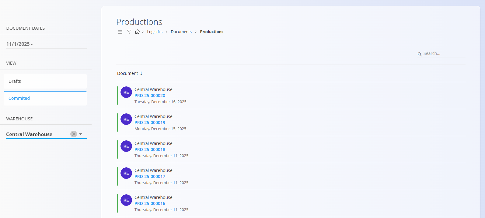

# Productions

A **Production** document records items that were produced during the execution of a **Production order**. Production documents are created automatically from the [**Execution**](../../Production/Documents/Execution.md) module when a production worker records produced outputs. They increase stock for the produced items and provide traceability of what was made.

For the production‑side entry of outputs, see **[Execution](../../Production/Documents/Execution.md)** (Outputs). Outputs are closely linked with this page: recording produced items in production creates the corresponding production document in logistics. For defining outputs on processes, see **[Outputs](../../Production/CodeLists/Outputs.md)**.

To access this page, go to **Logistics / Documents / Productions** in the [navigation](../../Common/UI/Navigation.md).

## Schema

### Document section

| Field | Description |
|-------|-------------|
| [**Code**](../../Common/UI/DocumentCodes.md) | Unique identifier of the production document (system‑generated). |
| **Created** | Timestamp when the document was created. |
| [**Warehouse**](../CodeLists/Warehouses.md) | Warehouse where the produced items were posted. |

### Detail section

| Field | Description |
|-------|-------------|
| [**Material**](../../Assets/Domain/Materials.md) | Produced item (typically a [product](../../Assets/CodeLists/Products.md) or [semi product](../../Assets/CodeLists/SemiProducts.md)). |
| **Quantity** | Produced quantity recorded for the material line. |

## List of production documents

The **Productions** page displays all production documents created through execution. You can filter the list using:

- **Document dates**
- **View**
  - *Draft* — production in progress (still being recorded in execution)
  - *Committed* — finalized production document
- **Author**
- **Warehouse**

## Actions

Production documents are **not** created manually from this page (there is no [**action button**](../../Common/UI/ActionButton.md)). They are created from the [**Execution**](../../Production/Documents/Execution.md) module while recording outputs for a production order.

Workflow notes:
- When a production worker starts recording outputs, a **Draft** production document is created automatically.
- When the [**Execution**](../../Production/Documents/Execution.md) process is completed, the document moves to **Committed** and can be reviewed in the committed list.

## Reviewing a production document

A production document contains:

### Linked documents
If the output was recorded for a production order, the **Linked documents** section shows a link to the related [**Production order**](../../Production/Documents/ProductionOrders.md).

### Document and Details
The **Details** section lists all produced items with their recorded quantities.

## Menu

Committed production documents can be corrected through reversals. Open the document menu and select:

- **Create a new reversal**

This creates a reversal document that negates the stock and financial effect of the production posting (depending on system configuration). See **[Reversals](Reversals.md)** for more details.

## Deletion

Production documents cannot be deleted from the system to ensure traceability of produced items, but they can be reversed as described above.

---