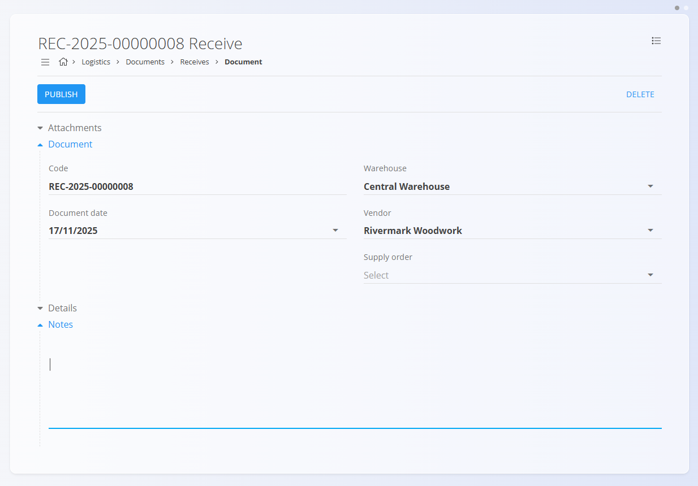
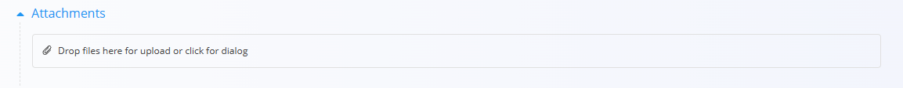
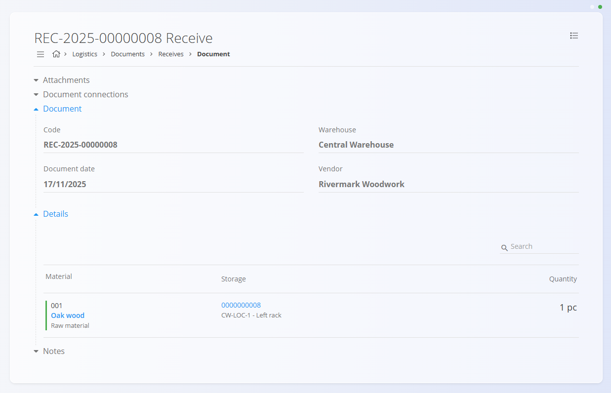

# Receives

A receive document is used to record the physical arrival of materials into your warehouse.  
It captures details about received items, packaging, quantities, and storage locations.

For a full walkthrough of how Receives work, watch the  
[Receive](https://www.youtube.com/watch?v=oTOYD-nlCqE) video.

To access Receives, go to **Logistics / Documents / Receives** in the [navigation](../../Common/UI/Navigation.md).

---

## Schema

### Document section

| Field | Description |
|-------|-------------|
| **Code** | System-generated unique identifier for the receive document. |
| **Document date** | Date when the goods were physically received. |
| **Warehouse** | Warehouse where the materials are being received. |
| **Vendor** | Supplier delivering the goods. |
| **Supply order** | (Optional) Linked supply order. See [Supply order](../../Supply/Documents/SupplyOrder.md). |
| **Notes** | Additional remarks related to the document. |

---

### Detail section

| Field | Description |
|-------|-------------|
| **Material** | Material being received (product, semi product, raw material, or repro). |
| **EAN** | Packaging or unit barcode. |
| **Net weight / Gross weight (kg)** | Weight information stored in the system or scanned. |
| **Dimensions (whd, mm)** | Width, height, and depth of the package. |
| **Warehouse location** | Storage location where the unit will be placed. |
| **Serial number** | Serial number scanned or generated. |
| **Best before** | Expiration date (for materials with shelf life). |
| **Packaging quantity (pc)** | Quantity represented by a single packaging unit. |
| **Quantity in base unit (pc)** | Quantity expressed in the material’s base measurement unit. |
| **Received quantity (pc)** | Quantity actually received. |
| **Number of packets** | Number of packages received. |

---

## List of receive documents

The Receives page displays all receive documents.  
You can filter the list using the left sidebar, which includes:

- **Document dates**
- **View:**  
  - *Drafts* — documents you created but have not yet published  
  - *Committed* — documents that are published and fixed
- **Author**
- **Warehouse**

A color indicator next to each document shows its status:

- **Green** — committed  
- **Gray** — draft

You can click any document to open and review its details.

---

## Actions

Click the **action button** to create a new receive document.

### Creating a receive document

To create a new receive document:

1. Click the **action button**, then select the **Vendor**.

2. Scan or manually enter the **EAN code of the packaging**.
   - The system displays **all matching materials and serial numbers**.  
3. The system automatically retrieves the packaging information and fills all relevant fields in the **Details** section.  

4. Adjust quantities, storage locations, or other values if needed.  
5. Click **Save** to save the details. Add more items starting from step 2 if needed.  
6. Click **Publish** to commit the document. 

A newly created receive document appears in the **Drafts** view. Once published, it moves to **Committed**.

---

## Attachments

At the top of every document, an **Attachments** section is available. 

You can upload any relevant file—such as delivery notes, transport documents, photos, or supporting records. All attached files remain stored together with the document and can be reviewed at any time.

---

## Notes

Each document includes a **Notes** section where you can enter any comments or additional information related to the transaction. Notes are saved together with the document and remain visible both in draft and committed versions.

---

## Menu

Inside a receive document, the **menu (hamburger icon)** in the top-right corner provides different options depending on the document status.

### Draft receive document

- Print  
- Export (PDF)  
- Delete all fields  

### Published receive document

- Print  
- Export (PDF)  
- Create a new reversal

---

## Reviewing a receive document

When you click a document from the list:

- You see its **Document** section (header information)
- You see all **Details** representing the received items
- You can edit draft documents
- You can print or export draft or committed documents
- Committed documents are read-only, except for reversal creation

## Deletion

Draft documents can be deleted, but only if they contain **no material entries**.

If the draft still includes materials in the **Details** section:

1. Click the material serial number to open the **Edit detail** screen.  
2. Click **Delete** inside the Edit detail window to remove the material.  
3. Repeat this for all remaining materials.

Once the document contains no materials, you can click **Delete** to remove the draft.

Committed documents **cannot** be deleted — only reversed (if applicable).