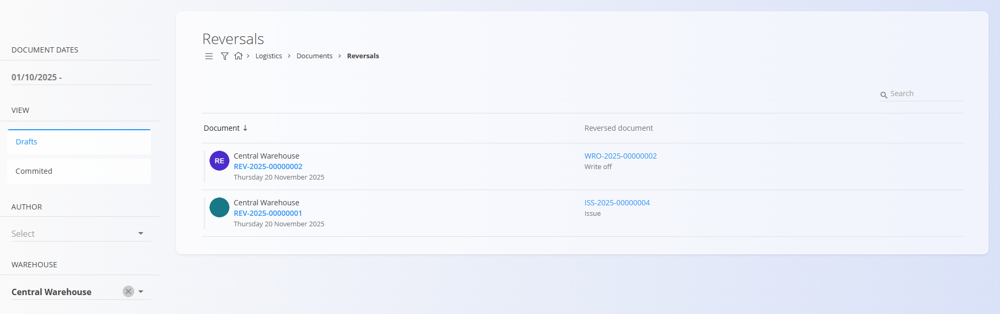
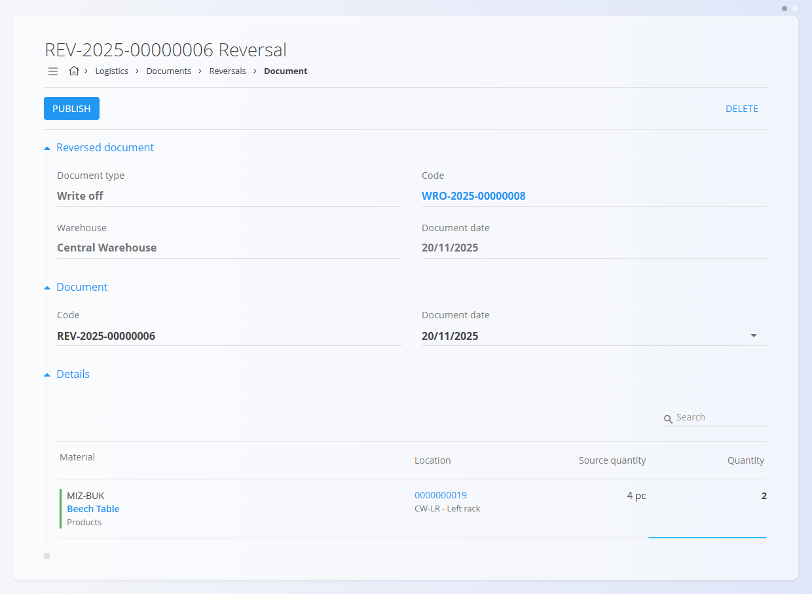
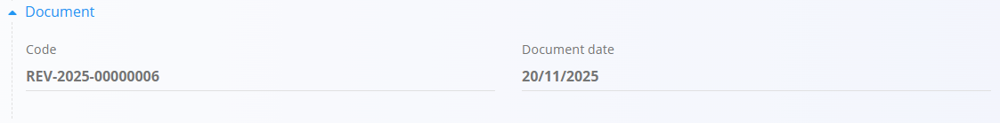

# Reversals

A **Reversal** document is used to undo (fully or partially) the effect of another logistics document — such as a **Receive**, **Issue**, **Writeoff**, or **Inter warehouse transfer**. You can reverse only committed documents, and only through their **Menu → Create a new reversal** option. Reversals cannot be created from the Reversals list.

A reversal adjusts stock levels according to the type of document being reversed. For example:
- Reversing a **Writeoff** returns stock to its previous location.  
- Reversing a **Receive** removes items (restoring them to the vendor conceptually).  
- Reversing an **Issue** returns items to their original warehouse/location.  
- Reversals can be **partial** or **full**.  
- Reversals **cannot** themselves be reversed.

For a full walkthrough, watch the [Reversal](https://www.youtube.com/watch?v=yfGNARBWm7Q) video.

To access Reversals, go to **Logistics / Documents / Reversals** in the [navigation](../Navigation.md).

---

## Schema

### Reversed document section

| Field | Description |
|-------|-------------|
| **Document type** | Type of document being reversed (Receive, Issue, Writeoff, Inter warehouse). |
| **Code** | Identifier of the reversed document (clickable). |
| **Warehouse** | Warehouse where the original document was executed. |
| **Document date** | Date of the original document. |

### Document section

| Field | Description |
|-------|-------------|
| **Code** | System-generated reversal document number. |
| **Document date** | Date of the reversal (editable). |

### Detail section

| Field | Description |
|-------|-------------|
| **Material** | Material being reversed. |
| **Location** | Storage location of the reversed stock. |
| **Source quantity** | Quantity originally processed in the reversed document. |
| **Quantity (pc)** | Quantity to reverse — **editable**, used for partial or full reversal. |

---

## List of reversal documents

The **Reversals** page displays all reversal documents. You can filter the list using:

- **Document dates**
- **View**  
  - *Drafts* — reversal documents created but not yet published  
  - *Committed* — confirmed reversal documents  
- **Author**
- **Warehouse**

Each row includes:

- The reversal document  
- The reversed document (with document type)

Color indicators:

- **Green** — committed  
- **Gray** — draft

---

## Actions

Reversal documents **cannot** be created manually from the Reversals page. They are created only from the source document through:

**Menu → Create a new reversal**

Once created:

- If saved but not published → it appears in **Drafts**
- If published → it appears in **Committed**

Tags displayed on the original document:

- **Reversal in progress** — when a reversal draft exists  
- **Partially reversed** — only part of the quantity was reversed  
- **Fully reversed** — the document has been completely reversed  

### Creating and publishing a reversal

#### Step 1 — Start the reversal  
Open the committed document you want to reverse. Open the **menu** and select **Create a new reversal**.

#### Step 2 — Edit reversal quantities  
A draft reversal document is generated automatically.

Each material line displays:

- **Source quantity**  
- **Editable quantity** field  

Examples:

- Original writeoff: **4 pc** → enter **4** for full reversal  
- Enter **2** → partial reversal  

#### Step 3 — Publish  
Click **Publish** to confirm the reversal.

If you don’t publish immediately:

- The reversal appears in **Drafts**
- The original document shows **Reversal in progress**

Once published:

- Stock levels are updated  
- The reversed document shows **Partially reversed** or **Fully reversed**  
- The reversal moves to **Committed**

---

## Reviewing a reversal document

A reversal document includes:

### Reversed document section  
Displays information about the document being reversed and a link to open it.

### Document section  
Shows reversal code and date.

### Detail section  
Lists affected materials, their locations, original quantities, and reversed quantities.

---

## Deletion

Click **Delete** to remove a **draft** reversal document. Committed reversals **cannot** be deleted.

A draft reversal can always be deleted because it does not contain dependent stock movements.

