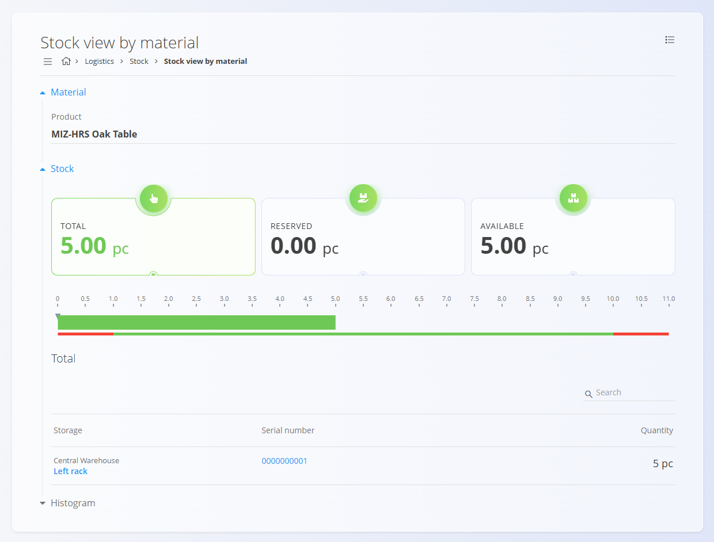
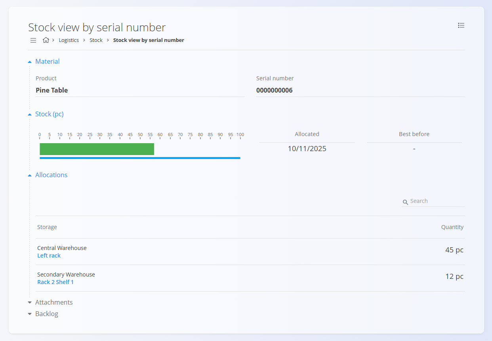

# Stock

The **Stock** page provides a complete overview of material quantities across the system. It shows how many items are available, blocked, or reserved, and lets you quickly find any material by searching or sorting the list. From here, you can open detailed stock views to understand where the material is stored, how it is used, and how it has moved over time.

You can access the **[Stock view by material](#stock-view-by-material)**, **[Stock view by location](#stock-view-by-location)**, or **[Stock view by serial number](#stock-view-by-serial-number)** to explore quantities, locations, movements, and storage history in more depth. Minimum and maximum thresholds that appear in related summaries can be configured in the **[Stock boundaries](StockBoundaries.md)** code list. The **[Dashboard](Dashboard.md)** also provides shortcuts to stock issues such as missing, overstocked, or out-of-stock materials.

> [!TIP]
> For a full demonstration, see the **[Stock overview](https://www.youtube.com/watch?v=gjAKnavIWnY)** video tutorial.

To access Stock, go to **Logistics / Stock** in the [navigation](../../Common/UI/Navigation.md).

## Filters and Navigation

The left sidebar contains several filters:

### **Calendar filter**
You can select a specific date to view stock levels as they were on that day.

Clicking the month name opens a fast month/year selection view:

### **Material type filter**
You can filter the list by:

- [Products](../CodeLists/Products.md)  
- [Semi products](../CodeLists/SemiProducts.md)  
- [Repro materials](../CodeLists/ReproMaterials.md)  
- [Raw materials](../CodeLists/RawMaterials.md) 

### **Tags filter**
You can refine the list by selecting material tags.

## Stock List

The main list displays all materials in alphabetical order.  
You can adjust the sorting:

- By **Material name** (A–Z or Z–A)  
- By **Quantity**  

A search field is available at the top to quickly find specific items.

Each row shows:

- **Material code and name**
- **Quantity**
- **Material type tag**

Click any material to open the detailed stock view.

## Stock View by Material

## Stock view by material

Clicking a **material name** opens a detailed breakdown of where the material is stored, including available, reserved, and blocked quantities across all [locations](../CodeLists/Locations.md). You can also open the **[Stock view by serial number](#stock-view-by-serial-number)** to explore individual batches or units.

> [!TIP]
> For a full demonstration, see the **[Stock view by material](https://www.youtube.com/watch?v=GUdnV6bZwoI)** video tutorial.

This view includes:

- **Total stock**
- **Reserved stock**
- **Available stock**
- A **visual bar scale** showing stock relative to min/max levels  
- A **storage-level breakdown**, including:
  - Warehouse and location  
  - Serial numbers (if applicable)  
  - Quantities  
- A **Histogram** section, showing how stock levels changed across selected dates.

A search field is available for filtering within the selected material.

## Stock view by location

The **Stock view by location** screen shows all materials stored in a specific [warehouse location](../CodeLists/Locations.md), along with their total, reserved, and available quantities. It is useful when you want to see what is physically stored in a particular rack, shelf, or storage area.

You can access this view in two ways:

- Through **Logistics / Views / Stock view by location**
- By clicking any **location name** inside other stock screens (such as Stock view by material)

For full details, see [**Stock view by location**](../Views/StockViewByLocation.md).

## Stock view by serial number

A material can have multiple **serial numbers** representing different batches, production dates, or [storage locations](../CodeLists/Locations.md). Clicking any serial number opens its dedicated view, where you can check movements, storage history, and attachments.

> [!TIP]
> For a full demonstration, see the **[Stock view by serial number](https://www.youtube.com/watch?v=_vzXNsGg5N4)** video tutorial.

This view shows:

- **Material and serial number** – the specific unit you are inspecting.  
- **Stock (pc) graph** – visual overview of total and available quantity for this serial number.  
- **Allocations** – a list of all storage locations where this serial number is present, including quantities.  
- **Attachments** – files related to this serial number (such as quality reports or photos).  
- **Backlog** – a timeline of all movements and transactions involving this serial number.

The **Stock view by serial number** screen is read-only and is used for detailed tracking and traceability of a specific serial number.

---

