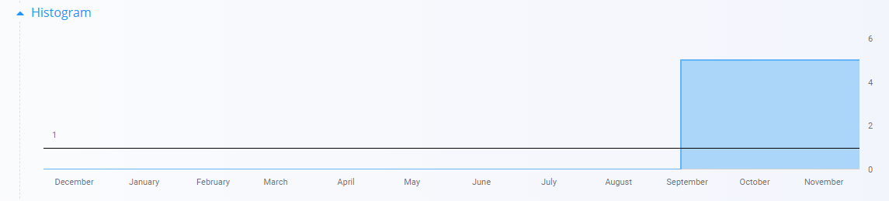

# Stock

The **Stock** page provides an overview of all material quantities across the system.  
It allows you to quickly check available, blocked, and reserved stock and navigate to detailed views for any material.

For a detailed explanation of how stock works, watch the  
[Stock overview](https://www.youtube.com/watch?v=gjAKnavIWnY) video.

To access this screen, go to **Logistics / Stock** in the navigation.

---

## Filters and Navigation

The left sidebar contains several filters:

### **Calendar filter**
You can select a specific date to view stock levels as they were on that day.

Clicking the month name opens a fast month/year selection view:

### **Material type filter**
You can filter the list by:

- Products  
- Semi products  
- Raw materials  
- Repro materials  

### **Tags filter**
You can refine the list by selecting material tags.

---

## Stock List

The main list displays all materials in alphabetical order.  
You can adjust the sorting:

- By **Material name** (A–Z or Z–A)  
- By **Quantity**  

A search field is available at the top to quickly find specific items.

Each row shows:

- **Material code and name**
- **Quantity**
- **Material type tag**

Click any material to open the detailed stock view.

---

## Stock View by Material

Clicking a material opens a detailed breakdown of stock distribution across storage locations.

This view includes:

- **Total stock**
- **Reserved stock**
- **Available stock**
- A **visual bar scale** showing stock relative to min/max levels  
- A **storage-level breakdown**, including:
  - Warehouse and location  
  - Serial numbers (if applicable)  
  - Quantities  

A search field is available for filtering within the selected material.

### **Histogram**

At the bottom of the page, a **Histogram** section is available, showing how stock levels changed across selected dates.

---

