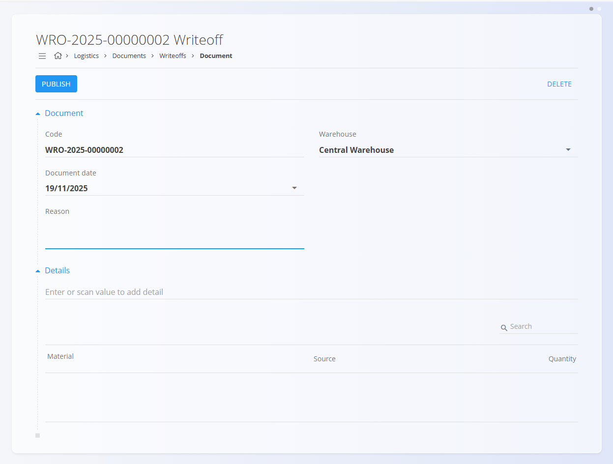
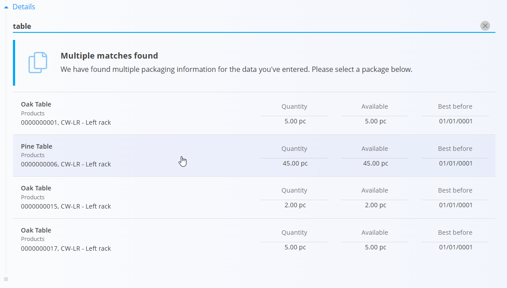

# Writeoffs

A **Writeoff** document is used to record damaged, lost, or otherwise unusable materials that need to be removed from stock. It allows you to specify the reason for the writeoff, select the affected items, and edit the quantities to be written off.

For a full walkthrough, watch the [Writeoffs](https://www.youtube.com/watch?v=_0jEGSTorsY) video.

To access Writeoffs, go to **Logistics / Documents / Writeoffs** in the [navigation](../../Common/UI/Navigation.md).

---

## Schema

### Document section

| Field | Description |
|-------|-------------|
| **Code** | System-generated unique identifier for the writeoff document. |
| **Document date** | Date when the writeoff is recorded. |
| **Warehouse** | The warehouse from which items are being written off. |
| **Reason** | Description of why the material is being removed (damage, loss, expiration, etc.). |

### Detail section

| Field | Description |
|-------|-------------|
| **Material** | The item being written off (product, semi product, raw material, or repro). |
| **Serial number** | Serial number of the affected unit. |
| **Best before** | Expiration date (if applicable). |
| **Warehouse location** | Location where the material is stored. |
| **Quantity (pc)** | Number of pieces being written off. The default value is the total number of available pieces at that location, but you should adjust it to match the real number being removed. |

---

## List of writeoff documents

The **Writeoffs** page shows all writeoff documents. You can search for a specefic document using the search bar, or filter using the left sidebar:

- **Document dates**
- **View**  
  - *Drafts* — documents created but not yet published  
  - *Committed* — completed writeoffs
- **Author**
- **Warehouse**

A color indicator shows the document status:

- **Green** — committed  
- **Gray** — draft

You can open any document to review its details.

**List view example:**

---

## Actions

Click the **action button** to create a new writeoff document.

### Creating a writeoff document

1. Click **Add new** to create a draft.
   

2. Select the **Warehouse** and optionally enter a **Reason**.

3. In the **Details** section, scan or type a **serial number**, **EAN**, or **material name**.
   - If only one match exists → the system autofills the details.
   - If multiple matches exist → a selection list appears:
   
     

4. Select the correct item to open the **Edit detail** window.

5. Adjust the **Quantity (pc)** to specify the number of damaged/missing pieces. The default value in the field is the total number available.

   

6. Click **Save** to save the detail. Add more items starting from step 3 if needed.

7. Once all items are added and verified, click **Publish** to finalize the writeoff.

Published writeoffs immediately update stock levels.

---

## Menu

Inside a **committed** writeoff document, the menu (hamburger icon) has the option to **Create a new reversal**.

The menu is **not available** for draft writeoff documents.

---

## Deletion

Draft writeoff documents can be deleted on the edit screen, but only if they contain **no material entries**.

If the draft still includes materials in the **Details** section:

1. Click the material serial number to open the **Edit detail** screen.  
2. Click **Delete** inside the Edit detail window to remove the material.  
3. Repeat this for all remaining materials.

Once the document contains no materials, you can click **Delete** to remove the draft.

Committed documents **cannot** be deleted — only reversed.

