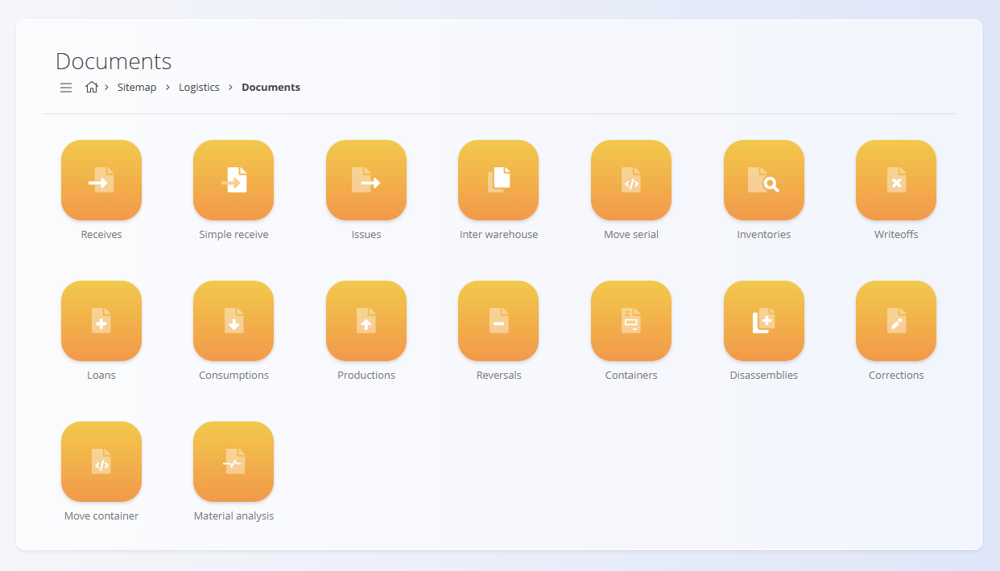
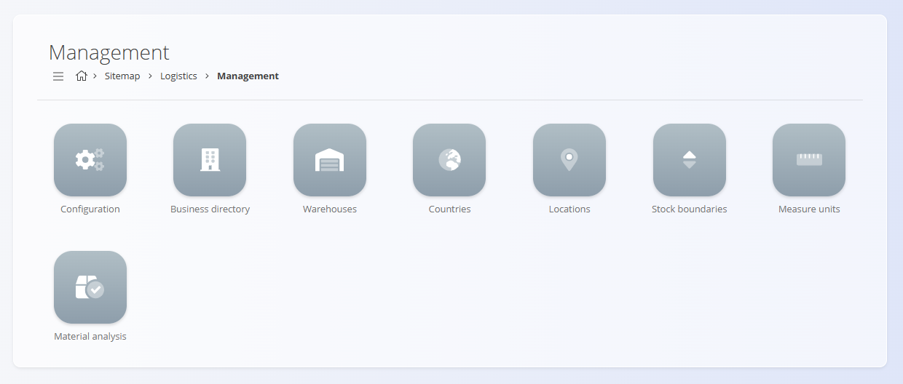

# Logistics

The **Logistics** domain covers all warehouse-related operations within your organization.  
It includes stock handling processes, warehouse structures, material movements, and all documentation needed to track the physical flow of goods.

Where the **[Materials](../../Assets/Domain/Materials.md)** domain defines *what* exists in stock, the Logistics domain defines *where it is stored*, *how it moves*, and *how it is controlled*.

To access Logistics, navigate to **Logistics** in the [navigation](../../Common/UI/Navigation.md).

> [!NOTE]  
> The available logistics documents and features depend on each company’s configuration and warehouse processes.

## What is included in the Logistics domain?

The domain is organized into several functional areas:

- [**Dashboard**](../Documents/Dashboard.md) – high-level overview of logistics activity and warehouse performance  
- [**Stock**](../Documents/Stock.md) – real-time warehouse visibility  
- [**Documents**](../Documents) – all stock-affecting logistics transactions  
- [**Views**](../Views) – analytical screens for consumption, issuing, and stock distribution  
- [**Management**](../CodeLists) – code lists and configuration for warehouses and locations

## Dashboard

The [**Dashboard**](../Documents/Dashboard.md) provides a high-level overview of logistics performance and warehouse activity. It presents operational indicators that help users understand current workload, stock movements, and active warehouse processes.

The dashboard serves as the entry point for warehouse supervisors and operators who need immediate insight into the state of logistics operations.

## Stock

The **[Stock](Documents/Stock.md)** section provides operational insight into warehouse materials and their current quantities. A detailed overview of all materials stored across warehouses and locations. It displays available quantities, batches, serials, and physical positions.

## Documents

The **Documents** section contains all logistics-related transactions that **change stock quantities** or **track warehouse activity**.

Available logistics documents include:

- **[Receives](Documents/Receives.md)** – Register goods entering the warehouse (procurement, production outputs, customer returns).
- **[Simple receive](Documents/SimpleReceive.md)** – A lightweight alternative for quick inbound registrations.
- **[Issues](Documents/Issues.md)** – Register goods leaving the warehouse (consumption, delivery, production input).
- **[Inter warehouse](Documents/InterWarehouse.md)** – Transfers goods between distinct warehouses or sites.
- **[Move serial](Documents/MoveSerial.md)** – Relocate or adjust serial-numbered materials.
- **[Inventories](Documents/Inventories.md)** – Perform stock counts and reconcile discrepancies.
- **[Writeoffs](Documents/Writeoffs.md)** – Adjust stock for damaged, lost, or expired materials.
- **[Loans](Documents/Loans.md)** – Track materials temporarily issued to personnel or external partners.
- **[Consumptions](Documents/Consumptions.md)** – Record material consumption events.
- **[Productions](Documents/Productions.md)** – Receive finished or semi-finished goods from production.
- **[Reversals](Documents/Reversals.md)** – Reverse previous logistics documents.
- **[Containers](Documents/Containers.md)** – Manage logistics containers, pallets, or grouped items.
- **[Disassemblies](Documents/Disassemblies.md)** – Break down products into components returned to stock.
- **[Corrections](Documents/Corrections.md)** – Manual corrections of stock records.
- **[Move container](Documents/MoveContainer.md)** – Relocate containerized goods as units.
- **[Material analysis](Documents/MaterialAnalysis.md)** – Perform diagnostics or quality checks on materials.

Each of these documents contributes to the traceability and accuracy of warehouse operations.

## Views

The **Views** section provides analytical tools for understanding stock movements, consumption patterns, and location-based distribution.

Available views include:

- **[Consumption details](Views/ConsumptionDetails.md)** – Detailed insight into material consumption trends and usage patterns.
- **[Issue details](Views/IssueDetails.md)** – Breakdown of issue transactions by material, document, warehouse, or user.
- **[Stock view by location](Views/StockViewByLocation.md)** – Hierarchical representation of stock quantities by warehouse, zone, and location.

These screens do **not** create transactions—they are analytical tools meant to support operational decisions.

## Management

The **Management** section contains configuration and master data required by all logistics processes.

Available code lists and configuration screens:

- **Configuration** – Logistics-wide settings and process behavior.
- **[Business directory](../Common/CodeLists/BusinessDirectory.md)** – Defines internal and external business entities related to logistics.
- **[Warehouses](../CodeLists/Warehouses.md)** – Definitions of physical warehouses or distribution sites.
- **[Countries](../Common/CodeLists/Countries.md)** – Geographic data supporting warehouse and partner records.
- **[Locations](../CodeLists/Locations.md)** – Storage positions inside warehouses (aisles, racks, bins).
- **[Stock boundaries](../CodeLists/StockBoundaries.md)** – Logical constraints and special handling rules for selected materials or locations.
- **[Measure units](../Common/CodeLists/MeasureUnits.md)** – Unified measurement units used across logistics documents.
- **[Material analysis](../CodeLists/MaterialAnalysis.md)** – Configuration supporting material inspection or validation processes.

These elements define how logistics operations behave and how data is structured.

## Logistics Processes

Logistics operations follow a consistent lifecycle:

### **1. Receiving goods**
- Goods enter the warehouse through receives or production outputs.

### **2. Moving and organizing**
- Goods are stored, relocated, or distributed across warehouses.

### **3. Issuing and consuming**
- Stock leaves the warehouse for production, sales, or internal use.

### **4. Inventory and reconciliation**
- Accuracy is maintained through inventories, write-offs, and corrections.

### **5. Reporting and analysis**
- Views provide insight into stock usage, availability, and discrepancies.

## Logistics and Other Domains

Logistics integrates tightly with other operational areas:

| Area | Interaction |
|--------|------------|
| **[Materials](../../Assets/Domain/Materials.md)** | Defines materials stored and moved in logistics. |
| **[Assets](../../Assets/Domain/AssetsDomain.md)** | Sales visibility and availability calculations rely on logistics stock. |
| **[Production](../../Production/Domain/Production.md)** | Issues and receives connect logistics with production orders. |
| **[Maintenance](../../Maintenance/Domain/Maintenance.md)** | Spare parts and maintenance stock flow through logistics. |
| **[Sales](../../Sales/Domain/SalesDomain.md)** / **[Supply](../../Supply/Domain/SupplyDomain.md)** | Logistics ensures availability and correct warehouse fulfillment. |

## Summary

The Logistics domain is the operational center for stock management.  
It ensures:

- accurate stock quantities  
- traceable material movements  
- structured warehouse definitions  
- reliable inbound and outbound flows  
- transparent reporting  

It connects the physical handling of goods with the digital processes of sales, production, supply, and service.

---
