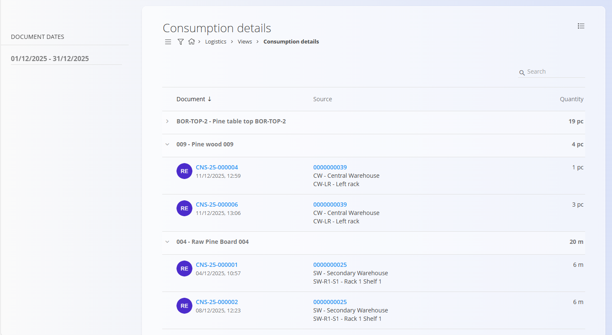

# Consumption details

The **Consumption details** view provides an analytical overview of all **materials consumed during production** within a selected time period. Instead of focusing on production documents, this view aggregates **consumed materials** and shows exactly **which consumption documents** were used and **from which warehouse locations** the materials were sourced.

To access this view, go to **Logistics / Views / Consumption details** in the [navigation](../../Common/UI/Navigation.md).

## Consumption details list

The list displays **all consumed materials**, grouped by material. Each row shows the **total quantity consumed** for that material in the selected date range.

You can expand a material row to view the **individual consumption documents** that contributed to the total.

### Hierarchy

The list is structured as follows:

- **Material** – consumed material and total quantity consumed  
  - **Consumption document** – individual consumption entry used in production  
    - **Source** – warehouse and location where the material was sourced  
    - **Quantity** – quantity consumed in that document  

When expanded, each consumption document shows:

- **Document number** – clickable, opens the consumption document used in production  
- **Document date and time**  
- **Source** – warehouse and location (clickable)  
- **Consumed quantity**

## Source navigation

The **Source** column shows:

- **Warehouse**
- **Exact warehouse location**

Clicking the source opens the **[Stock view by location](StockViewByLocation.md)** screen, filtered to the location from which the material was consumed. This allows you to review stock availability and other materials stored at that location.

## Filters

The left sidebar contains the following filter:

- **Document dates** – limits the view to consumption documents within the selected date range

Once the date range is selected, the list reloads automatically.

## Search

Use the **search bar** in the top-right corner to quickly filter results. The search works across:

- Material codes  
- Material names  
- Document numbers  
- Warehouse and location codes  

This makes it easy to find consumption related to a specific material, document, or storage location.

## Purpose

The **Consumption details** view is useful for:

- Analyzing material usage in production  
- Tracing which materials were consumed and from where  
- Auditing consumption quantities by material  
- Investigating stock movements related to production  

This view is **analytical only**. It does not allow creating, editing, or deleting documents.

> [!NOTE]
> - Quantities are displayed in the material’s base unit of measure (e.g. pcs, meters).  
> - Only materials that were actually consumed in production appear in the list.  
> - Issued materials (e.g. sales deliveries) are **not** shown here; this view focuses exclusively on **production consumption**.

## Related views

- **[Production orders](../../Production/Documents/ProductionOrders.md)** – review production processes that generate material consumption  
- **[Stock view by location](StockViewByLocation.md)** – review stock stored in a specific warehouse location  
- **[Stock view by material](Stock.md#stock-view-by-material)** – review stock movements and balances by material

---