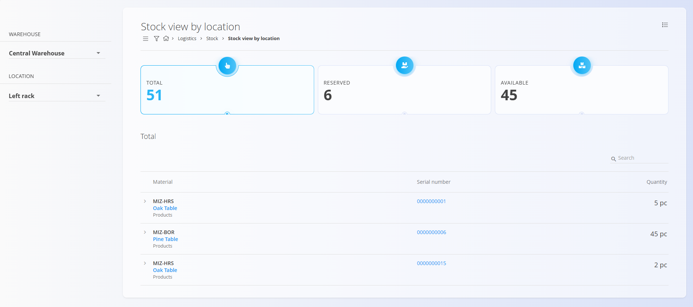
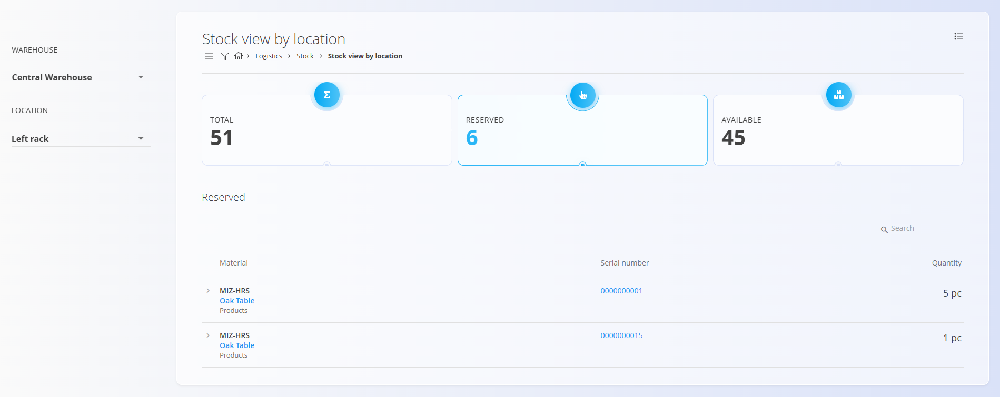
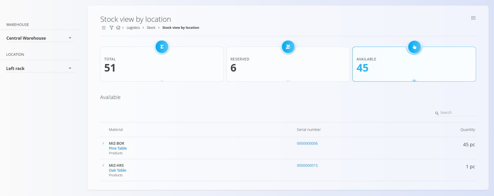
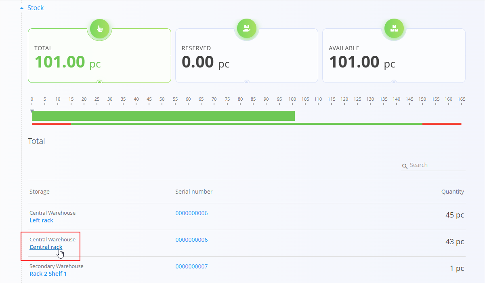

# Stock view by location

The **Stock view by location** screen shows all materials stored in a specific [warehouse location](../Management/Locations.md). It provides a clear overview of total, reserved, blocked, and available quantities at that location. This helps you understand how stock is distributed and whether storage capacity or organization needs adjustment.

You can navigate to related views—such as the **[Stock view by material](../Documents/Stock.md#stock-view-by-material)** or the **[Stock view by serial number](../Documents/Stock.md#stock-view-by-serial-number)**—to explore how items arrived at this location or where else they may be stored. Minimum and maximum stock rules can be defined in the **[Stock boundaries](../Management/StockBoundaries.md)** code list, and broader stock conditions can be reviewed on the **[Dashboard](../Documents/Dashboard.md)**.

> [!TIP]
> For a full demonstration, see the **[Stock view by location](https://www.youtube.com/watch?v=_3bZBZ89hds)** video tutorial.

To access this view, go to **Logistics / Views / Stock view by location** in the [navigation](../../Common/UI/Navigation.md), or click any **location name** from stock-related screens such as **Stock view by material**.

## Overview

Stock view by location consists of:

- **Warehouse selector**  
- **Location selector**  
- **Three indicators:**  
  - **Total** — all pieces stored in the location  
  - **Reserved** — pieces allocated to open documents  
  - **Available** — pieces that can be issued or moved  
- **A list of materials** stored in the selected location

## Selecting a warehouse and location

Use the left panel to select:

- **Warehouse**  
- **Location** (within the selected warehouse)

Once a location is selected, the system loads the corresponding stock:

## Indicators

The top section displays three key indicators:
- Total
- Reserve
- Available

Clicking any indicator filters the material list to display only items relevant to that category.

### Total
Shows the **total quantity** of all materials stored in the selected location.

### Reserved
Shows the **quantity reserved** through open Issue or Inter warehouse documents.

### Available
Shows the **quantity available** for use (Total – Reserved).

## Material list

Below the indicators, you see a detailed list of stock stored in the location.

Each row shows:

- **Material code and name**
- **Material type**
- **Serial number**
- **Quantity in the location**

## Accessing Stock view by location from other screens

You can also open this view by clicking a **location name** in other stock-related screens. This automatically loads the warehouse and location, showing only stock stored there.

Example from Stock view by material:

