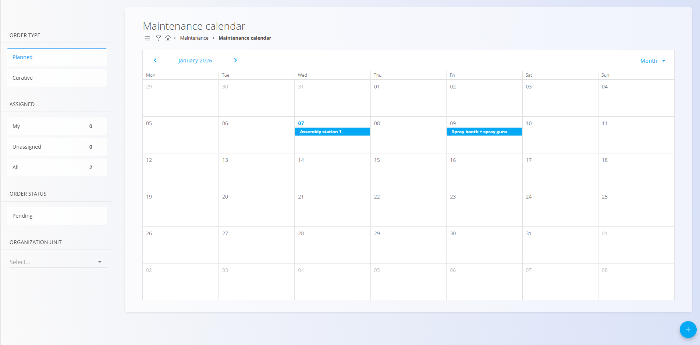
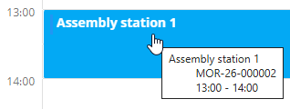
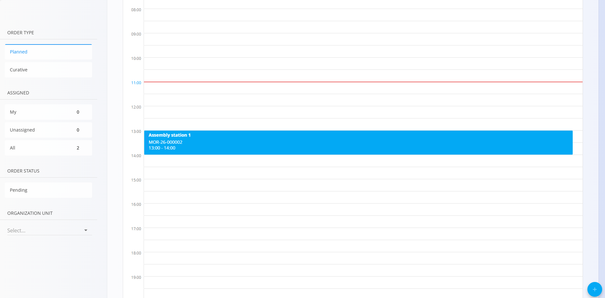

# Maintenance calendar

The **Maintenance calendar** provides a time-based overview of [**active maintenance orders**](MaintenanceOrders.md). It allows users to plan, review, and navigate maintenance activities using a calendar layout.

To access this screen, go to **Maintenance / Maintenance calendar**.

### Overview

The calendar displays active [maintenance orders](MaintenanceOrders.md) positioned on a timeline according to their planned execution date and time.

The calendar supports different time scales to suit planning and review needs.

When hovering over a calendar entry, a tooltip displays additional information such as:
- Equipment to be maintained
- Maintenance order code
- Scheduled time

## Navigation and interaction

- Clicking a [**maintenance order**](MaintenanceOrders.md) in the calendar opens the corresponding **maintenance order document**.
- Clicking the [**action button**](../../Common/UI/ActionButton.md) creates a new maintenance order.

For details about maintenance order creation and management, see **[MaintenanceOrders](MaintenanceOrders.md)**.

## Views

The calendar can be displayed in the following views, selectable from the top-right corner:

- **Day** – detailed view of maintenance orders for a single day
- **Week** – overview of maintenance orders across a week
- **Month** – high-level overview of planned maintenance orders

## Filters

The following filters are available on the left side of the screen:

### Order type
- **Planned**
- **Curative**

### Assigned
- **My**
- **Unassigned**
- **All**

### Order status
- **Pending**

### Organization unit
- Select one or more organization units

Filters can be combined to narrow down the calendar view to relevant maintenance orders.

---
