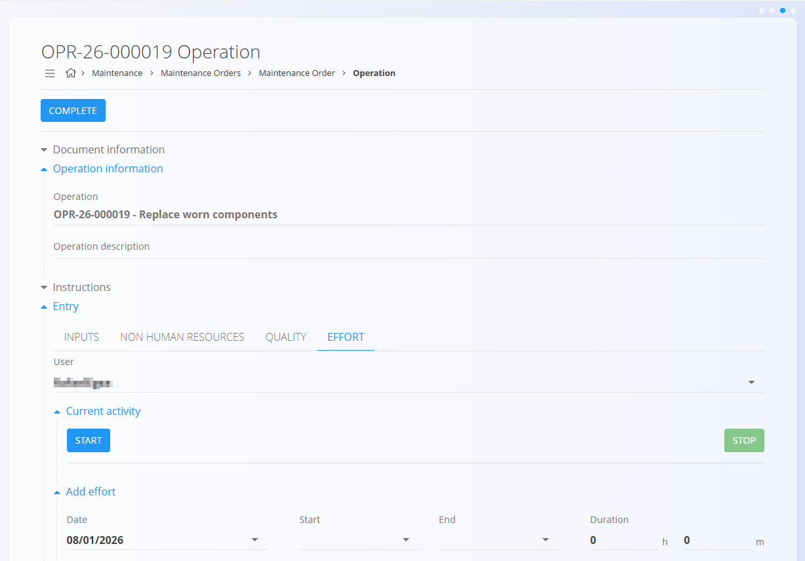
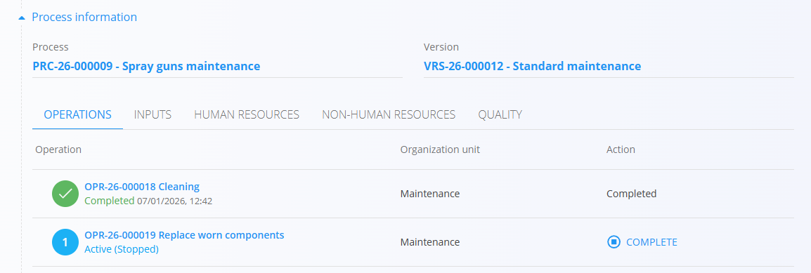

# Maintenance Order – Quick User Guide

This guide shows the **essential steps** for technicians and maintenance workers to **carry out maintenance work** using an **active maintenance order** in TomPIT.

> [!NOTE]
> This is a **quick operational guide** intended for maintenance execution only.  
> It does not cover order creation, planning, or scheduling.

## 1. Open your maintenance order

Open the **active maintenance order** you are assigned to.

The maintenance order shows:
- Equipment being maintained
- Maintenance operations to be executed

All maintenance work is carried out through the **Operations** section.

## 2. Open an operation

Click an operation in the **Operations** list to open the **operation execution screen**.

The screen includes:
- Document and operation information
- Instructions
- Execution sections such as:
  - Quality
  - Inputs
  - Non-human resources
  - Effort

## 3. Complete checklists (when required)

If checklists are defined for the operation, they will appear automatically at the appropriate moment:
- On start
- During execution
- On completion

While a checklist is active, other execution sections (such as Inputs and Effort) are not available and become accessible only after the checklist is completed.

To continue, complete the checklist and click **Finish**.

> **Important**  
> Required checklists must be completed before continuing with the operation.

## 4. Follow instructions

If instructions are defined:
- Review them before starting the task
- Use them as guidance while performing the work

Instructions may include safety notes, step-by-step actions, or visual references.

## 5. Record consumed materials (if applicable)

If materials are used during maintenance:
1. Open the **Inputs** section
2. Select the material
3. Enter the quantity used
4. Save the entry

This ensures correct material tracking and traceability.

## 6. Record effort (working time)

Effort represents the time spent working on the operation.

### Automatic effort tracking
- Click **Start**
- Perform the maintenance work
- Click **Stop** when finished

### Manual effort entry
1. Open the **Effort** section
2. Enter the required time information
3. Save the entry

## 7. Complete the operation

When all required work is finished:
1. Ensure:
   - Checklists are completed
   - Materials are recorded (if used)
   - Effort is logged
2. Click **Complete** (top-left of the operation screen)

Once completed:
- The operation is marked as **Completed**
- It appears as completed in the maintenance order

## 8. Continue with the next operation

Return to the maintenance order and repeat the steps for the next operation.

After all operations are completed, the maintenance work is finished and recorded for the equipment.

---