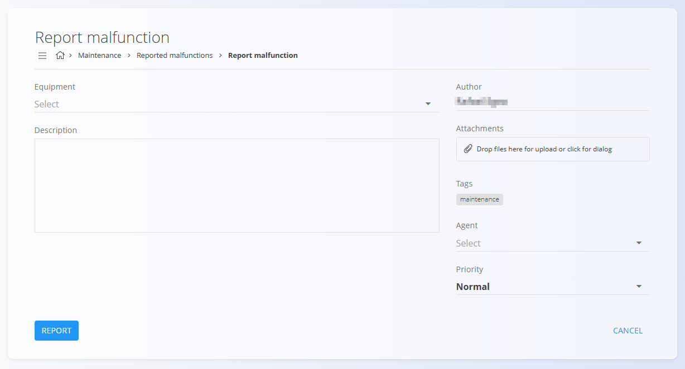
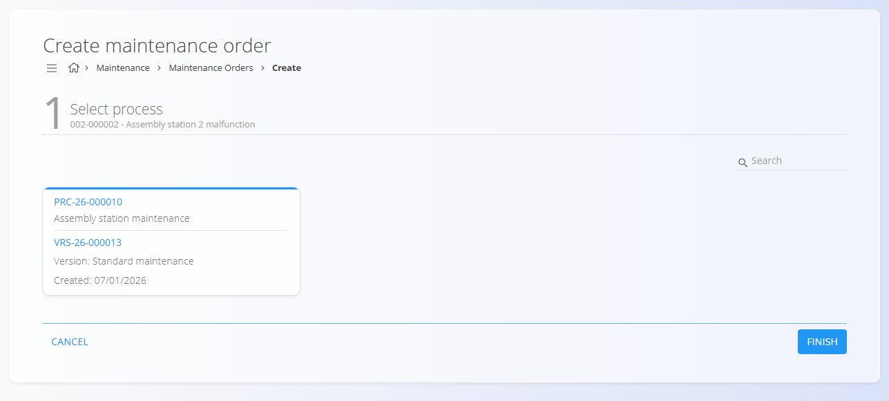

# Reported malfunctions

Reported malfunctions record **issues detected on equipment during production or operation**.  They serve as an entry point for **curative maintenance**, allowing maintenance teams to review reported issues and, when required, create a maintenance order directly from the malfunction.

To access reported malfunctions, go to **Maintenance / Reported malfunctions** in the [**navigation**](../../Common/UI/Navigation.md).

## List of reported malfunctions

The Reported malfunctions page displays all reported issues, grouped by assignment.

### Status overview

At the top of the page, summary cards show the number of malfunctions:

- **My** – Malfunctions assigned to the current user
- **Unassigned** – Malfunctions without an assigned agent
- **All** – Total number of reported malfunctions

Clicking a card filters the list accordingly.

### Available filters

- **View**
  - **New** — Newly reported malfunctions
  - **Pending** — Malfunctions under review or awaiting action
- **Priority** — Filter malfunctions by priority

The search bar allows filtering by malfunction code or equipment name.

## Malfunction details

Clicking a malfunction in the list opens the **malfunction detail** screen.

The detail view includes:

- **Equipment** – The affected equipment
- **Author** – User who reported the malfunction
- **Description** – Description of the issue
- **Attachments** – Optional supporting files or images
- **Tags** – Classification of the malfunction (for example *Machine failure*)
- **Agent** – Assigned maintenance agent
- **Priority** – Severity of the malfunction

From this screen, maintenance teams can review the issue and decide on the appropriate corrective action.

## Creating a malfunction report

To create a new malfunction report, click the [**action button**](../../Common/UI/ActionButton.md).

Fill in the malfunction details and click **Report**. The new entry appears in the malfunction list.

## Creating a maintenance order from a malfunction

From the malfunction detail screen, click **Create maintenance order** to generate a [maintenance order](MaintenanceOrders.md) based on the reported issue.

This action creates a new **curative maintenance order** with the following behavior:

- The creation flow consists of **a single step**
- The maintenance order is created in **Pending** state
- **Priority is inherited from the reported malfunction**
- Equipment information is pre-filled from the malfunction
- The malfunction context is preserved for traceability

Once created, the maintenance order follows the standard maintenance order life cycle and can be activated and executed from the [**Maintenance orders**](MaintenanceOrders.md) screen.

---
