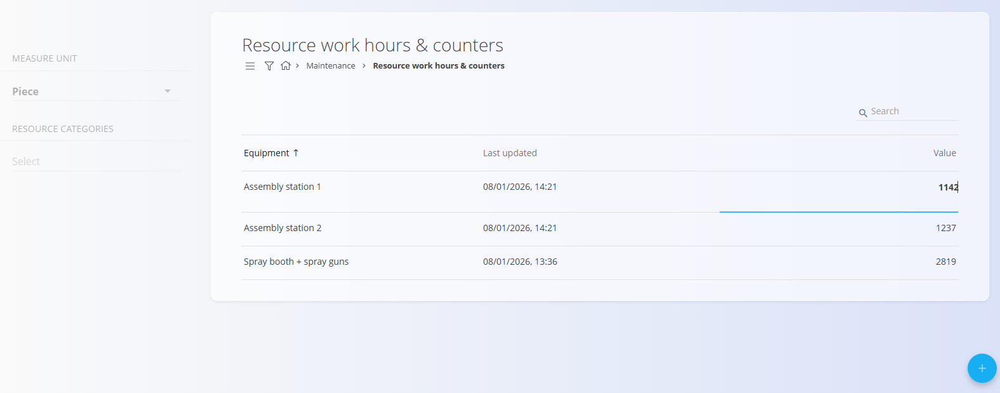

# Resource work hours & counters

The **Resource work hours & counters** screen is used to track **usage values** for equipment, such as produced pieces, operating hours, distance, volume, or any other measurable unit.

These values are used by **count-based [maintenance schedules](MaintenanceSchedule.md)** to automatically generate maintenance orders when defined thresholds are reached.

To access this screen, go to **Maintenance / Resource work hours & counters** in the [**navigation**](../../Common/UI/Navigation.md).

## Overview

Each row represents a **counter** associated with a specific piece of equipment and a specific [measure unit](../../Common/Management/MeasureUnits.md).

The list shows:
- **Equipment** – The resource being tracked
- **Last updated** – Date and time of the last value change
- **Value** – Current counter value

Filters on the left allow narrowing the list by:
- **Measure unit**
- **Resource categories**

The search field can be used to locate equipment by name.

## Adding a resource counter

Click the [**action button**](../../Common/UI/ActionButton.md) to create a new counter.

Provide:
- **Measure unit** – Unit used for the counter (for example *Piece*, *Hour*, *Liter*)
- **Equipment** – Equipment for which the counter is tracked
- **Value** – Initial counter value

Click **Add** to create the counter.

> **Note**
>  
> Only one counter per equipment and measure unit can exist.

## Editing counter values

Counter values can be updated directly from the list.

To edit a value:
1. Click on the **number in the Value column**
2. Enter the new value
3. Confirm the change

The **Last updated** timestamp is automatically refreshed when the value changes.

## Usage in maintenance scheduling

Counters are typically used together with **count-based maintenance schedules**.

When a maintenance order is configured with:
- **Schedule type** = Count  
- **Execution pattern** = Based on a measure unit and value  

The system compares the **current counter value** with the defined schedule interval to determine when a new maintenance order should be generated.

### Example – Count-based maintenance

The following example illustrates how resource counters are used to trigger maintenance orders.

1. A counter is defined for an equipment:
   - **Equipment**: Spray booth
   - **Measure unit**: Piece
   - **Value**: 643

2. A maintenance order is created with a **count-based schedule**:
   - **Schedule type**: Count
   - **Every**: 200 pieces

3. The system evaluates the counter value against the schedule:
   - Maintenance thresholds occur at: 200, 400, 600, 800 pieces
   - The current value (643) is above 600, so the next maintenance is expected at 800 pieces

4. When the counter value is updated to **800 or higher**, the system automatically generates a new maintenance order.

This approach ensures that maintenance is triggered based on **actual equipment usage** rather than fixed time intervals.

---
