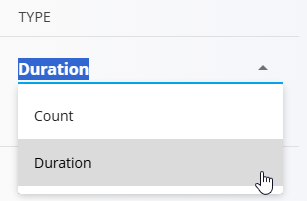
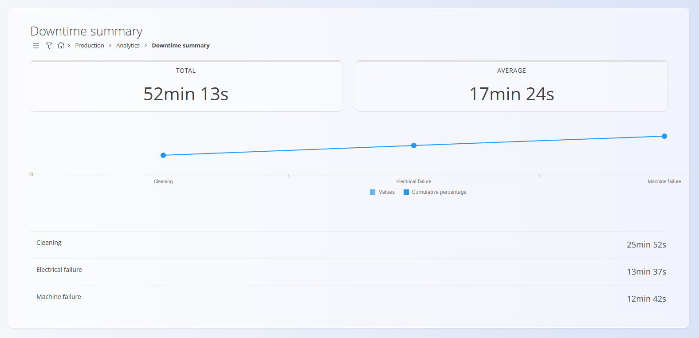

# Downtime summary
The **Downtime summary** page provides an overview of recorded production downtimes within a selected period. It helps identify the most common downtime reasons, evaluate their impact, and monitor performance across organization units and equipment.

To access this page, go to **Production / Analytics / Downtime summary** in the [**navigation**](../../Common/UI/Navigation.md).

> [!TIP]
> For a full demonstration, see the **[Downtime summary](https://www.youtube.com/watch?v=IdEsZkN2Wv0)** video tutorial.

## Filters
Use the filters on the left to refine the displayed data.

### Type
Determines how downtime data is aggregated:
- **Count** — number of downtime events
- **Duration** — total downtime duration

### From / To
Select the date range for which downtime records should be included.

### Organization units
Filter results by one or more [organization units](../CodeLists/OrganizationUnits.md).

### Non human resources
Filter downtimes associated with specific equipment or workstations.

## Page layout and results
The downtime summary displays two key indicators:

| Metric | Meaning |
|--------|---------|
| **Total** | Total downtime (sum of all selected downtime events) |
| **Average** | Average downtime per event |

Below the indicators, a graph displays downtime classifications (e.g., electrical failure, mechanical issue) with:
- **Values** — actual downtime per reason
- **Cumulative percentage** — contribution to total downtime
At the bottom, a detailed list shows:
- Downtime **classification name**
- Corresponding **count or duration**

## Example

In the example above:
- **Duration** mode is selected
- Total downtime within the chosen interval is **52 min 13 s**
- Average downtime per event is **17 min 24 s**
- Downtime is split across three types:
  - **Cleaning** — **25 min 52 s**
  - **Electrical failure** — **13 min 37 s**
  - **Machine failure** — **12 min 42 s**
- The chart and list reflect the same breakdown by downtime type (including the cumulative percentage line)

---

