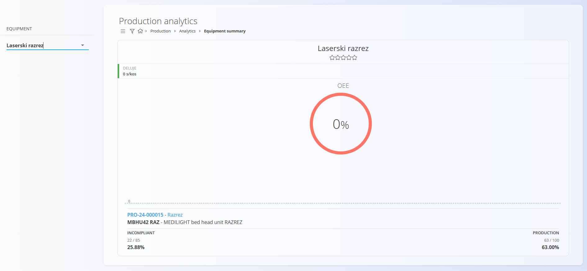

# Equipment summary

The Equipment summary page provides an overview of machine performance, including downtime, production output, quality, and OEE (Overall Equipment Effectiveness). It helps supervisors and managers understand how each machine is performing over time.

To access this page, go to **Production / Analytics / Equipment summary** in the [**navigation**](../../Common/UI/Navigation.md).

> [!TIP]
> For a full demonstration, see the **[Equipment summary](https://www.youtube.com/watch?v=PXPXDL5yL4w)** video tutorial.

## Filters

### Equipment  
Select the machine or workstation to display analytics for.

## Summary header

Shows the selected machine name and rating (if used).

## Machine status

Displays the machine’s current operating condition:

- **Running** – shows the cycle time (e.g., `0 s/piece`)  
- **Downtime** – shows the duration of the active downtime  

The status label may vary depending on machine state (e.g., *Working*, *Stopped*).

## OEE indicator

A circular gauge representing the machine’s **Overall Equipment Effectiveness** (%).  

If insufficient data is available, OEE may show **0%**.

## Production and quality overview

Below the OEE indicator, the system shows the most recent or active production operation performed on this machine.

This includes:

### Production order and operation  
- Clickable [production order](../Documents/ProductionOrders.md) code (e.g., `PRO-24-000015`)  
- [Operation](../Management/Operations.md) description  
- [Material](../../Assets/Domain/Materials.md) being produced (e.g., product or semi product)

### Incompliant  
Shows defective pieces relative to total produced:
- **Count** – defective / produced  
- **Percentage** – defect rate

### Production  
Shows production progress for the current operation:
- **Produced / Planned**  
- **Percentage completed**

This section helps monitor both productivity and product quality for the selected equipment.

