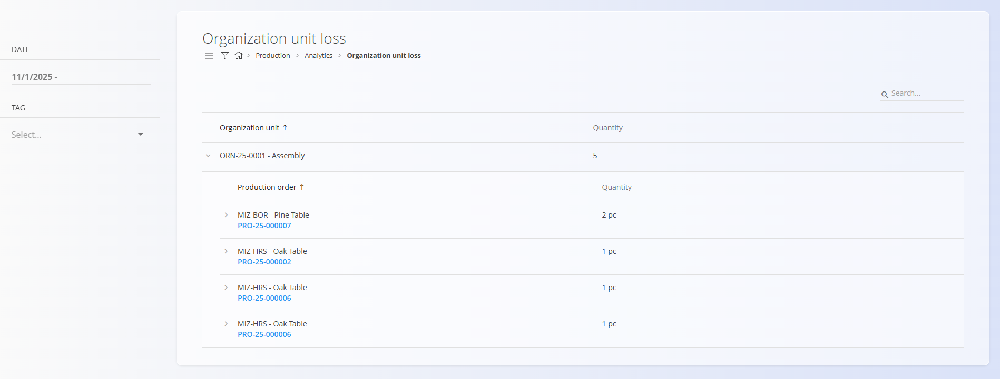

# Organization unit loss

The **Organization unit loss** page provides an overview of all recorded production losses grouped by organizational unit. It allows supervisors and planners to quickly see how many defective or unusable items were produced in each organizational unit and from which production orders the losses originated.

To access this page, go to **Production / Analytics / Organization unit loss** in the [navigation](../../Common/UI/Navigation.md).

## Filters

Use the filters on the left to refine the results:

- **Date** — Select a date or date range for which loss entries should be displayed.  
- **Tag** — Filter losses by loss classification tag (see [Loss classification tags](../Management/LossClassificationTags.md)).

## Loss overview

The main table displays loss entries grouped by **Organization unit**.

For each organizational unit, the following is shown:

- **Quantity** — Total number of defective items recorded

Expanding an organizational unit displays its related **Production orders**, along with:

- **Material** — The material item involved  
- **Production order** — Direct link to the order  
- **Quantity** — Number of defective units recorded within that order  

Loss entries can be expanded or collapsed for easier navigation.

## Usage notes

- Only loss entries recorded through the *Execution* module are shown here.  
- Use tags to analyze recurring defect types and improve quality control.  
- This view helps identify which production orders or work areas contribute most to overall loss.

---

