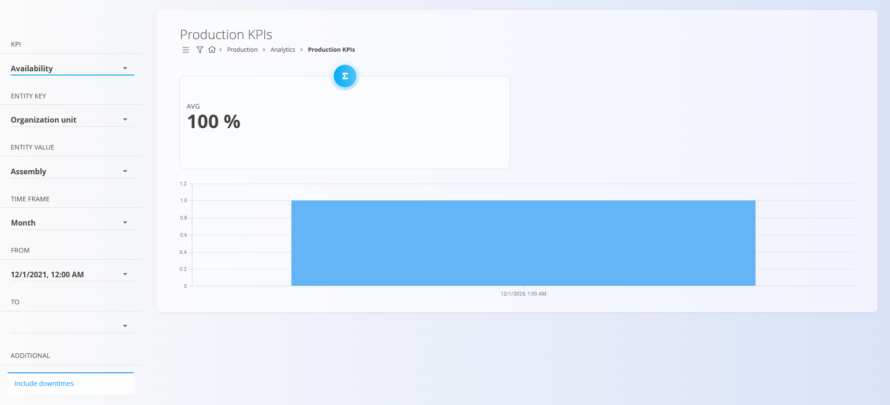

# Production KPIs

The **Production KPIs** page provides analytical insights into key production performance indicators. It enables monitoring of efficiency, quality, downtime, and equipment or organizational unit performance over a selected time period. 

To access this page, go to **Production / Analytics / Production KPIs** in the [navigation](../../Common/UI/Navigation.md).

> [!TIP]
> For a full walkthrough of production analytics, see the **[Key Performance Indicators](https://www.youtube.com/watch?v=zzs6wJh-tQY)** video tutorial.

## Filters

The left-side panel includes several filters that define what KPI data is shown.

### KPI
Select which production indicator to analyze.

| KPI | Meaning |
|-----|---------|
| **Actual operation time** | Total operation time, including downtimes |
| **Actual production time** | Time spent producing, excluding downtime |
| **Ideal production** | Expected production quantity based on standards |
| **Quality ratio** | Percentage of defective units vs. total units |
| **Unplanned downtime** | Total time of unplanned stoppages |
| **Incompliant production** | Number of defective units |
| **Planned downtime** | Total time of planned stoppages |
| **Production** | Total number of produced units |
| **Availability** | Operating time without downtime |
| **Overall equipment effectiveness (OEE)** | Combined indicator of quality, availability, and efficiency |
| **Effectiveness** | Ratio between planned performance and actual results |
| **Compliant production** | Number of good (non-defective) units |

### Entity key
Defines what type of asset the KPI is measured for:
- **Equipment**
- **Organization unit**

### Entity value
Select the specific equipment or organizational unit, based on the entity key.

### Time frame
Defines the reporting granularity, for example:
- **Day**
- **Week**
- **Month**
- **Year**

### From / To
Select the date and time range for which KPI data should be displayed.

### Additional settings
- **Include downtimes** – When enabled, downtime values are included in KPI calculations where applicable.

## KPI results

The KPI results are displayed at the top of the page and include:
- **AVG** – The average value of the selected KPI over the chosen period  
- A **bar or line chart** showing the KPI trend across the selected time frame  

Depending on the selected KPI, additional details may appear below the graph:
- For **downtime KPIs**, downtime reasons and durations  
- For **production KPIs**, compliant and incompliant quantities  
- For **equipment KPIs**, daily or hourly performance indicators  

