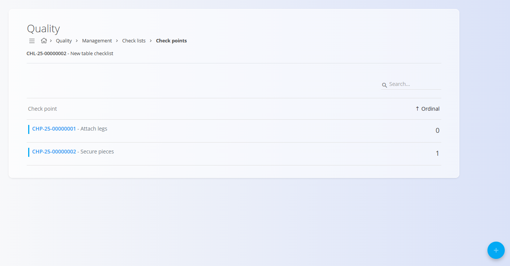

# Check points

Check points belong to a specific **Checklist** and define the individual steps, controls, or verifications that operators must perform during production or quality checks.  
They ensure consistent process execution and provide structured data for audit trails and reporting.

To access the check points for a checklist, open **Production / Management / Checklists**, and click the **Check points** button of the desired checklist.

---

## Schema

| Field | Description |
|-------|-------------|
| [**Code**](../../Common/UI/DocumentCodes.md) | Auto-generated unique identifier for the check point. |
| **Name** | Name of the check point (mandatory). |
| **Description** | Additional details or context for the check point. |
| **Ordinal** | Number defining the order in which the check point appears in the checklist. |
| **Category** | Optional classification used to group or filter check points. |
| **Optional** | Indicates whether the check point may be skipped during execution. |
| **Type** | Defines the operator input required: • **Check** – Simple checkbox confirmation • **File upload** – Requires attaching a file (image, PDF…) • **List** – Choose single or multiple values from a predefined list • **Number** – Numerical input • **Text** – Free-text field |
| **Confirm text** | Text displayed next to the checkbox for **Check** type. |
| **Instructions** | Additional guidelines shown to the operator performing the check. |

## List view

The list displays all check points belonging to the selected checklist, sorted by **Ordinal**.

Use the search bar to filter check points by name or code.

## Creating a new check point

1. Click on the [**action button**](../../Common/UI/ActionButton.md) in the bottom-right corner.  
2. Fill in the fields described in the schema:  
   - **Name** (mandatory)  
   - **Description** (optional)  
   - **Ordinal** – Determines position in the checklist  
   - **Category** – Select a category if applicable  
   - **Optional** – Mark if the check point is not required  
   - **Type** – Select the input type required from the operator  
   - **Instructions** – Provide process guidelines

   

3. Click **Add** to save the check point.

## Editing an existing check point

1. Select a check point from the list.  
2. Modify any field, including **Type**, **Category**, or **Instructions**.  
3. Click **Save**.

## Deletion

Check points can be deleted freely unless restricted by a workflow configuration. To remove one, open the check point and click **Delete**.

---
