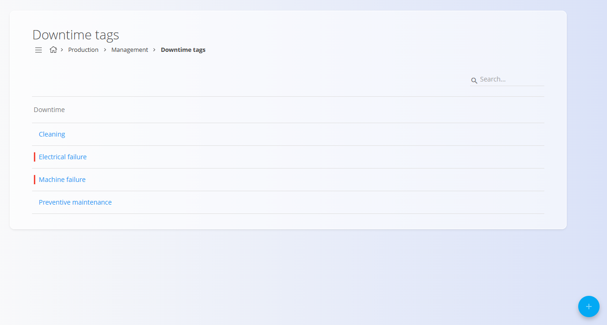
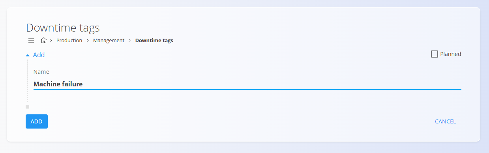
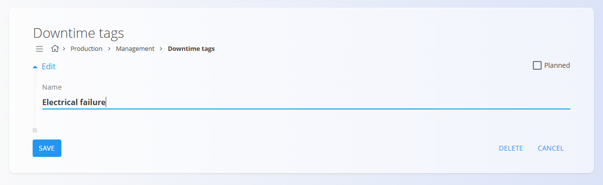

# Downtime tags

Downtime tags are used to classify and record the reasons for interruptions in production processes. They help track issues such as equipment failures, planned maintenance, or cleaning, and are later used in production reports and efficiency analysis.

To access this page, go to **Production / Management / Downtime tags** in the [navigation](../../Common/UI/Navigation.md).

> [!TIP]
> For a full demonstration, see the **[Downtime tags](https://www.youtube.com/watch?v=pgYdfZoKnOA)** video tutorial.

## Schema

| Field | Description |
|-------|-------------|
| **Name** | The name of the downtime reason (e.g., Machine failure, Cleaning) (mandatory).|
| **Planned** | Indicates whether the downtime is scheduled (planned). Unchecked items appear in red to highlight unplanned downtime. |

## List view

The list displays all downtime tags defined in the system. The **Search** bar filters tags by name.

- **Unplanned** downtime tags appear with a **red indicator** in the list.

## Creating a new downtime tag

1. Click on the [**action button**](../../Common/UI/ActionButton.md) in the bottom-right corner.

2. Fill in the following fields:
- **Name** – The downtime reason  
- **Planned** – Enable this option if the downtime is scheduled (such as preventive maintenance)

    

3. Click **Add** to save the new tag.

## Editing an existing tag

To edit a tag:

1. Click the tag in the list to open the Edit page.  
2. Modify the **Name** or update the **Planned** checkbox.  

    

3. (Optional) Disable the tag by unchecking **Active**.  
4. Click **Save**.

## Deletion

A downtime tag can be deleted from its Edit page by clicking **Delete**. If confirmed, the tag is removed from the system.

---

