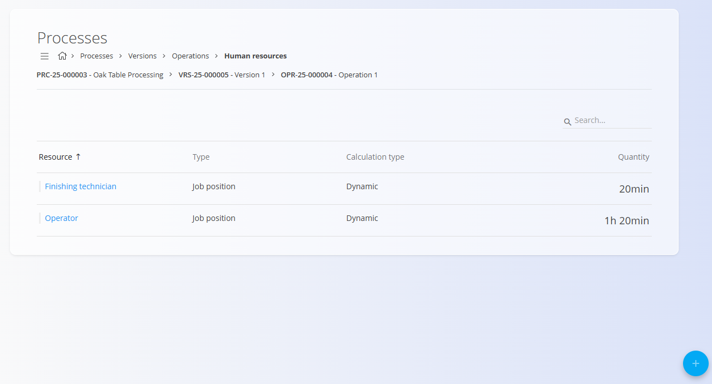
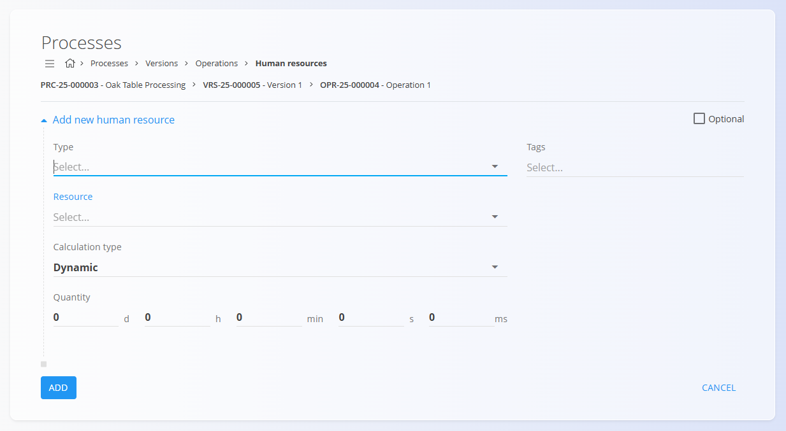

# Human resources

Human resources define which people or roles are required to execute a specific operation in a process. Each entry represents planned time for a person, job position, or resource involved in the work.

To access this page, open a process version from **Production / Management / [Processes](Processes.md)**, click [**Operations**](Operations.md), then select **Human resources** for a specific operation.

## Schema

| Field | Description |
|-------|-------------|
| **Type** | Defines what kind of resource is used:  • **Competence** • [**Job position**](../CodeLists/JobPositions.md) • [**Resource**](../CodeLists/Resources.md) |
| **Resource** | The specific competence, job position, or resource selected based on the chosen **Type**. |
| **Calculation type** | Defines how the planned time is calculated.  • **Dynamic** – time is calculated based on production quantity or other process parameters.  • **Static** – Quantity is fixed. |
| **Quantity** | Planned time requirement for this human resource, entered as a duration (days, hours, minutes, seconds, milliseconds). |
| **Tags** | Optional labels used to categorize or filter human resource assignments. |
| **Optional** | When enabled, the resource is not strictly required for the operation to be executed. |

## List view

The Human resources list shows all human resource assignments for the selected operation, including:

- **Resource** – name of the competence, job position, or resource  
- **Type** – the selected resource type  
- **Calculation type**  
- **Quantity** – planned duration  

Use the **Search** bar to filter by resource name.

## Creating a new human resource entry

1. Click the [**action button**](../../Common/UI/ActionButton.md) in the bottom-right corner and choose **New** (or a copy option, if available).
2. Fill in the fields:

   - **Type** – Competence, Job position, or Resource  
   - **Resource** – The specific item for the chosen type  
   - **Calculation type** – How time should be calculated (e.g., Dynamic)  
   - **Quantity** – Planned duration (d / h / min / s / ms)  
   - **Tags** – (Optional) classification tags  
   - **Optional** – Enable if the resource is not mandatory

   

3. Click **Add** to save the entry.

## Editing a human resource entry

1. Click a resource row in the list to open the Edit page.  
2. Adjust **Type**, **Resource**, **Calculation type**, **Quantity**, **Tags**, or **Optional** as needed.  
3. Click **Save**.

## Deletion

A human resource entry can be deleted from its Edit page by clicking **Delete**. If confirmed, it is removed from the operation.

---