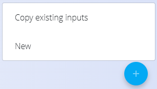
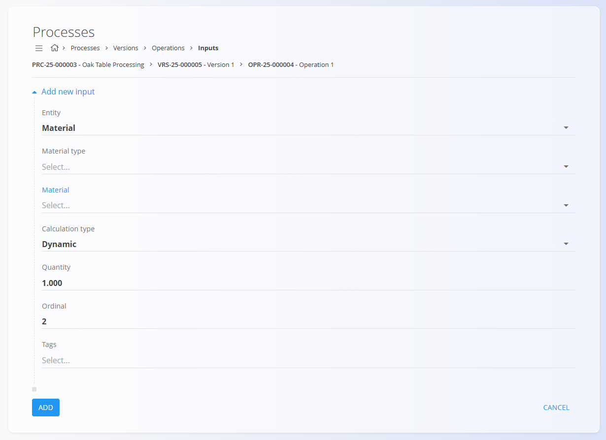

# Inputs

Inputs define the **materials required** to perform an operation within a process version. Each input specifies what material is needed, in what unit and quantity, and how it should be calculated.
Inputs are managed inside an **Operation**. 

To access this page, open a process version from **Production / Management / [Processes](Processes.md)**,  click [**Operations**](Operations.md), then select **Inputs** for a specific operation.

> [!TIP]
> For a full demonstration, see the **[Inputs & Outputs](https://www.youtube.com/watch?v=647sT70tNZc)** video tutorial.

## Schema

| Field | Description |
|-------|-------------|
| **Entity** | Select whether the input refers to a [**Material**](../../Assets/Domain/Materials.md) or a **Material tag**. |
| **Material type** | The category of the material:  • **[Products](../../Assets/CodeLists/Products.md)** • **[Raw material](../../Assets/CodeLists/RawMaterials.md)** • **[Repro materials](../../Assets/CodeLists/ReproMaterials.md)** • **[Semi products](../../Assets/CodeLists/SemiProducts.md)** |
| **Material** | The specific item being consumed (depends on the selected **Material type**). For example, for a raw material, it could be an **Oak Wood Board**. |
| **Calculation type** | Determines how the quantity is calculated:  • **Dynamic** – Quantity depends on production order quantities.  • **Static** – Quantity is fixed. |
| **Quantity** | Input amount required. The [**measure unit**](../../Common/CodeLists/MeasureUnits.md) depends on the selected material (e.g., pieces, kg, meters). |
| **Ordinal** | Defines the order in which inputs are listed (0-based). |
| **Tags** | Optional tags for grouping or filtering inputs. |

## List view

The list displays all inputs linked to the selected operation, showing material, entity type, quantity, and ordinal. Use the **Search** bar to filter by material name.

## Creating a new input

1. Click the **action button** in the bottom-right corner and choose one of the following:

    - **Copy existing outputs**
    - **New**

    

2. Fill in the required fields.

   

3. Click **Add** to save the new input.

## Editing an input

To edit an existing input:

1. Click the entry in the list.
2. Adjust the fields as needed.
3. Click **Save**.

## Deletion

An input can be deleted from its Edit page by clicking **Delete**. If confirmed, it is removed from the operation.

---