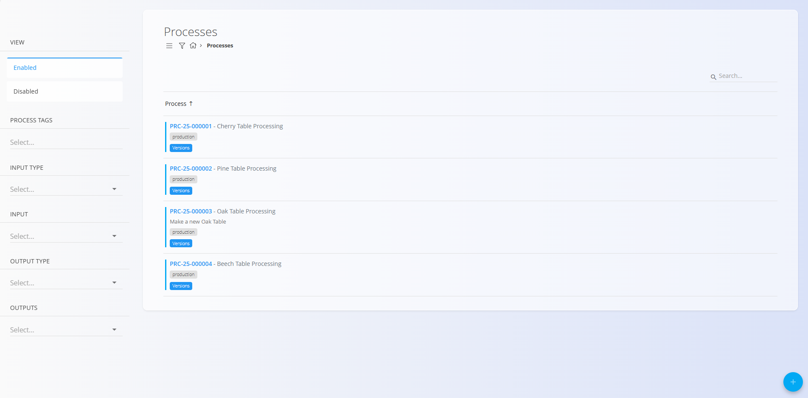
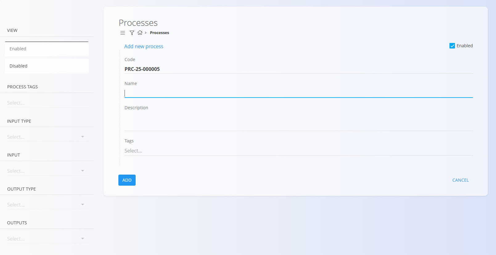
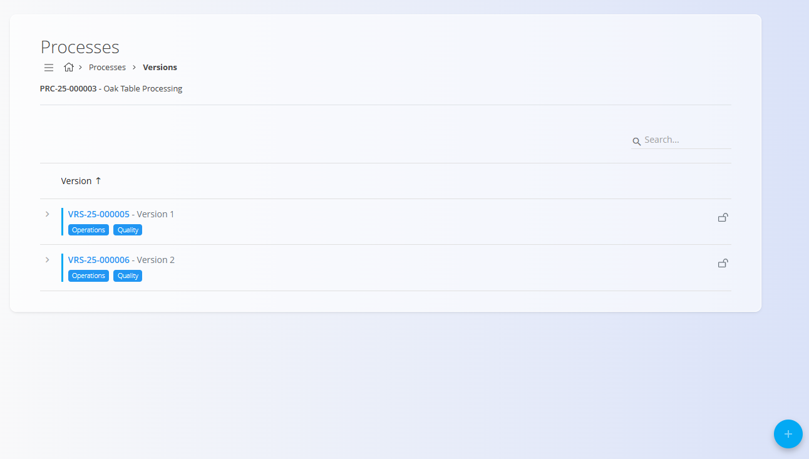
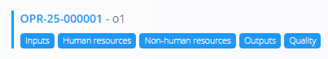

# Processes

Processes define the structured steps used in **Production** to transform inputs into finished or intermediate outputs. They form the backbone of production workflows and are used in **Production orders** to calculate materials, resources, workloads, and execution steps. This page allows you to create and manage processes, their versions, and their operational structure.

A process may contain one or more **versions**, for example, different versions for different table sizes. Each version contains a sequence of **operations**, which define inputs, resources, outputs, and quality requirements.

To access this page, go to **Production / Management / Processes** in the [**navigation**](../../Common/UI/Navigation.md).

## Schema

### Process fields

| Field | Description |
|-------|-------------|
| [**Code**](../../Common/UI/DocumentCodes.md) | Automatically generated process code (read-only). |
| **Name** | The name of the process (mandatory). |
| **Description** | A short explanation of what the process accomplishes. |
| **Tags** | Optional tags used to group or categorize the process. |

### Version fields

| Field | Description |
|-------|-------------|
| [**Code**](../../Common/UI/DocumentCodes.md) | Automatically generated version code (read-only). |
| **Name** | Version name (mandatory). |
| **Description** | Optional additional details about the version. |

## List view

The Processes list displays all production processes. Each row includes the process code, name, description, and tags. Use the **Search** bar to find processes by name or code.

The left-side panel provides filters for:

- **View**: Enabled / Disabled  
- **Process tags**  
- **Input type**  
- **Input**  
- **Output type**  
- **Outputs**

## Creating a new process

1. Click the [**action button**](../../Common/UI/ActionButton.md) and select **New** or **Copy existing**.
2. Fill in the following fields:  
   - **Name** – Required  
   - **Description** – Optional  
   - **Tags** – Optional  

    

3. Click **Add** to create the new process.

## Editing a process

To edit an existing process:

1. Select a process from the list.
2. Update the **Name**, **Description**, or **Tags** as needed.
3. Click **Save** to apply changes.

## Versions

Each process may include multiple **versions**, allowing you to update or improve a workflow over time while keeping older versions intact.

From the Versions screen, you can:

- Add a new version  
- Edit or disable a version  
- Lock a version  
- Open a version to work with its operations and configuration screens  

A version includes:

- Basic version information  
- A list of **operations**  
- Enable/disable controls  
- The option to **lock** a version to prevent edits  

## Operations inside a version

A version contains a sequence of **[operations](Operations.md)**, each representing a step of the process. Operations may include, for example, cutting, painting, assembly, or packaging depending on the workflow.

To access the list operations of a version click on the **[Operations](Operations.md)** button:

Each operation includes:

- **[Inputs](Inputs.md)** – Materials or items consumed by the operation  
- **[Human resources](HumanResources.md)** – Workers or job positions required  
- **[Non-human resources](NonHumanResources.md)** – Machines or equipment  
- **[Outputs](Outputs.md)** – Materials or items produced by the operation  
- **[Quality](QualityChecklists.md)** – Assigned checklists and quality requirements

## Quality

The **[Quality](QualityChecklists.md)** button opens the configuration page for the selected process version or operation. This page allows you to assign one or more [**Checklists**](Checklists.md), which define the quality-control steps required during production.

## Deletion

A process can be deleted only if it is **not used in any production orders** and **not referenced by other processes**.  
If allowed, the **Delete** action is available in the Edit page.

---
