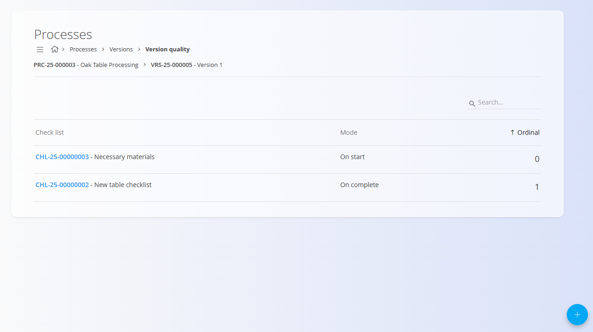
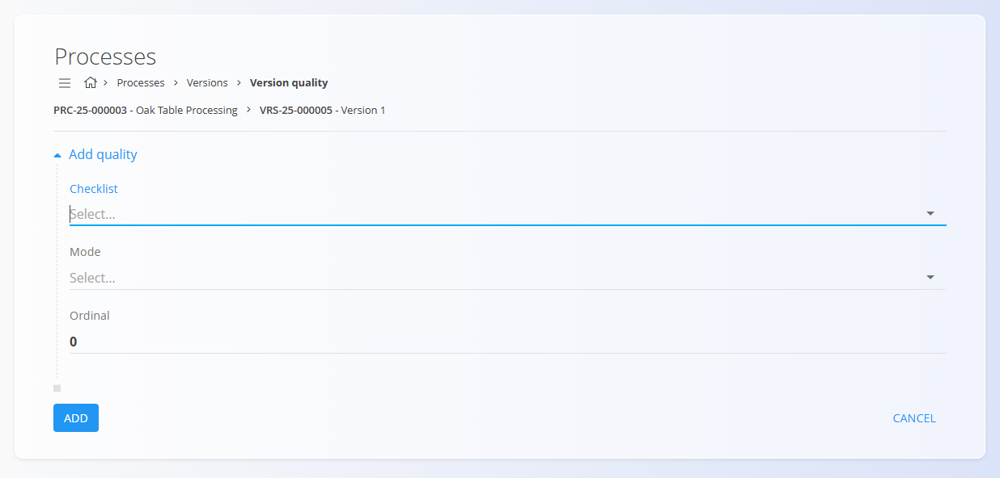

# Quality

The **Quality** page allows you to link **checklists** to either a **process version** or an **operation**.  
These checklists are used to enforce quality-control steps during production.

To access this page, click the **Quality** button from:

- A **Process version**  
  

- An **Operation**  
  

## Schema

| Field | Description |
|-------|-------------|
| **Checklist** | The checklist to attach. Selected from [**Checklists**](Checklists.md). *(mandatory)* |
| **Mode** | When the checklist should be executed:  • **Manual** • **On start** • **On run** • **On pause** • **On complete** |
| **Ordinal** | Defines the order in which checklists appear and execute inside the version or operation. |

## List view

When opened, the Quality page displays all checklists already linked to the process version or operation.

You may reorder entries by adjusting their **Ordinal** value.

## Creating a new quality entry

1. Click the **action button** in the bottom-right corner.  
2. Select a **Checklist**, choose the **Mode** for execution timing, and adjust the **Ordinal** if necessary.
   
   

3. Click **Add**.

## Editing a quality entry

1. Click a row in the list.  
2. Modify the **Checklist**, **Mode**, or **Ordinal**.  
3. Click **Save**.

## Deletion

A quality entry can be deleted from its Edit page by clicking **Delete**. If confirmed, it is removed from the version or operation.

---
