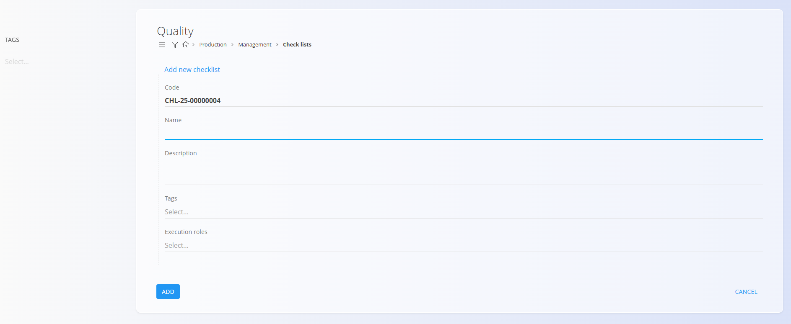

# Quality — Execution checklists

The **Quality** page allows you to link **checklists** to either a **process version** or an **operation**. These checklists are used to enforce quality-control steps during production.

To access this page, click the **Quality** button from:

- A **Process version**  
  

- An **Operation**  
  

## Schema

| Field | Description |
|-------|-------------|
| **Checklist** | The checklist to attach. Selected from [**Checklists**](Checklists.md). *(mandatory)* |
| **Mode** | When the checklist should be executed:  • **Manual** • **On start** • **On run** • **On pause** • **On complete** |
| **Ordinal** | Defines the order in which checklists appear and execute inside the version or operation. |

## List view

When opened, the Quality page displays all checklists already linked to the process version or operation.

You may reorder entries by adjusting their **Ordinal** value.

## Creating a new quality entry
# Checklists

Checklists are used in **Production** to define structured lists that support various operational or quality-control procedures. This page allows users to create and categorize checklists.

The individual steps inside a checklist — called **[Check points](Checkpoints.md)** — are managed separately.

To access this page, go to **Production / Management / Checklists** in the [**navigation**](../../Common/UI/Navigation.md).

## Schema

| Field | Description |
|-------|-------------|
| [**Code**](../../Common/UI/DocumentCodes.md) | Automatically generated checklist code (read-only). |
| **Name** | The name of the checklist (mandatory). |
| **Description** | A short explanation of the checklist’s purpose. |
| **Tags** | Optional tags used to categorize or group checklists. |
| **Execution roles** | Optional roles defining which job positions may execute the checklist. |

## List view

The list displays all checklists defined in the system. Each row shows the checklist code, name, and description. Use the **Search** bar to filter by name or code.

Each checklist entry includes a **Check points** button used to manage the steps within that checklist.

## Filters

The list includes a **Tags** filter on the left, allowing you to show only checklists associated with specific tags.

## Creating a new checklist

1. Click the [**action button**](../../Common/UI/ActionButton.md) in the bottom-right corner.
2. Fill in the following fields:

    

    - **Name** – The name of the checklist  
    - **Description** – Optional description  
    - **Tags** – Select one or more tags to categorize the checklist  
    - **Execution roles** – Select which job positions can execute this checklist

3. Click **Add** to create the checklist.

## Managing check points

Each checklist may contain one or more **check points**, which define the specific steps or validations required during its execution.

To manage check points:

1. Open the **Checklists** page.
2. Locate the checklist and click the **Check points** button.

    

This opens the **Check points** page, where you can add, edit, delete, and reorder check points.

For detailed information, see **[Check points](Checkpoints.md)**.

## Editing a checklist

To edit an existing checklist:

1. Click on a checklist entry in the list.
2. Modify the **Name**, **Description**, **Tags**, or **Execution roles** as needed.
3. Click **Save**.

## Deletion

A checklist can be deleted freely from its Edit page by clicking **Delete**. If confirmed, the checklist is permanently removed from the system.

---

1. Click the **action button** in the bottom-right corner.  
2. Select a **Checklist**, choose the **Mode** for execution timing, and adjust the **Ordinal** if necessary.
   
   

3. Click **Add**.

## Editing a quality entry

1. Click a row in the list.  
2. Modify the **Checklist**, **Mode**, or **Ordinal**.  
3. Click **Save**.

## Deletion

A quality entry can be deleted from its Edit page by clicking **Delete**. If confirmed, it is removed from the version or operation.

## See also

- [Quality (Execution activity)](../Documents/Quality.md)
- [Checklists](Checklists.md)
- [Check points](Checkpoints.md)

---
