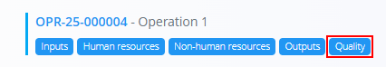
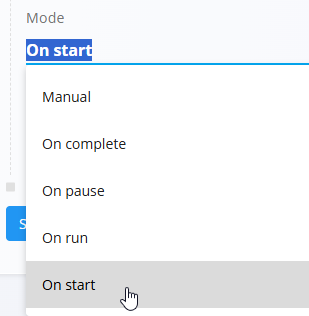

# Quality — Execution checklists

The **Quality** page allows you to link **[checklists](Checklists.md)** to either a **process version** or an **operation**. These checklists are used to enforce quality-control steps during production.

To access this page, click the **Quality** button from:

- A **Process version**  
  

- An **Operation**  
  

> [!NOTE]
> Prepare the checklist first in the **[Checklists](Checklists.md)** code list. Only defined checklists can be linked here.

> [!TIP]
> For a full demonstration, see the **[Quality](https://www.youtube.com/watch?v=B2KX_UvDiCw)** video tutorial.

## Schema

| Field | Description |
|-------|-------------|
| **Checklist** | The checklist to attach. Selected from [**Checklists**](Checklists.md). *(mandatory)* |
| **Mode** | When the checklist should be executed:  • **Manual** • **On complete** • **On pause** • **On run** • **On start** |
| **Ordinal** | Defines the order in which checklists appear and execute inside the version or operation.|

## List view

When opened, the Quality page displays all checklists already linked to the process version or operation.

You may reorder entries by adjusting their **Ordinal** value.

## Creating a new quality entry

1. Click the **action button** and choose **New**.

   

2. Select **Checklist** and **Mode**:
   - **Manual**: Operators open and complete the checklist on demand (from the Quality activity). Use for ad‑hoc or non‑blocking checks.
   - **On complete**: The checklist must be finished before the operation can end. Use for final inspections, packaging verification, or sign‑off.
   - **On pause**: The checklist appears when the operation is paused. Use to capture reasons, interim inspections, or handover checks.
   - **On run**: The checklist shows while the operation is running (e.g., mid‑process sampling or periodic checks). It can be prompted by time/quantity rules or manually.
   - **On start**: The checklist appears immediately when the operation starts. Use for safety checks or setup confirmations required before work begins.

    
 
3. Click **Add**.

## Editing a quality entry

1. Open the entry from the list.
2. Update **Checklist**, **Mode**, or **Ordinal** as needed.
3. Click **Save** to apply changes.

## Deletion

Click **Delete** on the Edit page.
