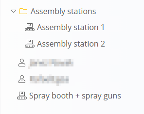
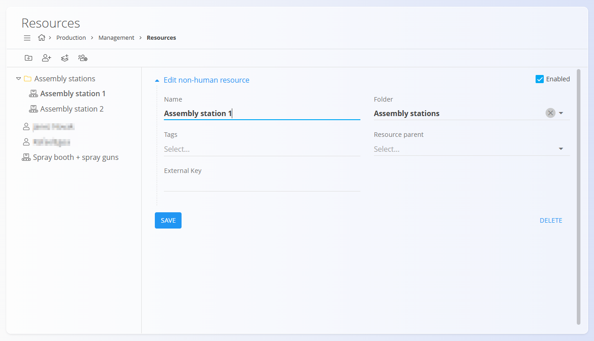

# Resources

Resources are used to define and manage all **human** and **non-human** assets available in Production. These include workers, machines, workstations, equipment, and teams. Resources created here can later be assigned to **operations**, **processes**, and **production orders**.

To access this page, go to **Production / Management / Resources** in the [**navigation**](../../Common/UI/Navigation.md).

## Schema

## Schema

The following table lists all fields used across Human, Non-human, and Team resources.

| Field | Description | H | NH | T |
|-------|-------------|:-:|:--:|:-:|
| **User** | Links the resource to a system user (mandatory). | ✔️ |  |  |
| **Name** | Name of the resource or team (mandatory). | ✔️ | ✔️ | ✔️ |
| **Folder** | Folder where the resource or team resides. | ✔️ | ✔️ | ✔️ |
| **Tags** | Labels for classification or filtering. | ✔️ | ✔️ | ✔️ |
| **Teams** | Teams to which a human resource belongs. | ✔️ |  |  |
| **Resource parent** | Parent resource for hierarchical grouping. |  | ✔️ |  |
| **External Key** | External identifier for integration. |  | ✔️ |  |
| **Members** | Human resources included in the team. |  |  | ✔️ |
| **Enabled** | Indicates whether the resource/team is active. | ✔️ | ✔️ | ✔️ |

---

## Toolbar actions

- **Add folder** – Creates a folder to organize resources.
- **Add human resource** – Creates an individual human resource.
- **Add non-human resource** – Creates a machine, workstation, or equipment resource.
- **Add team** – Creates a human resource group.

## Structure

Resources are displayed in a **tree view**. Items may or may not be inside folders:

Examples:
- **Assembly stations** (folder)  
  • Assembly station 1 (non-human)  
  • Assembly station 2 (non-human)
- **John Doe 1** (human resource)
- **John Doe 2** (human resource)
- **Spray booth + spray guns** (non-human resource not in any folder)

> [!NOTE]
> Folders are optional; standalone resources can exist without belonging to one.

## List view

Selecting an item shows its details and the Edit form.

## Creating a new resource

1. Choose from the toolbar:
   - **Add folder**
   - **Add human resource**
   - **Add non-human resource**
   - **Add team**
2. Complete the fields described in the appropriate schema section.
3. Click **Add** or **Save** to confirm.

## Editing a resource

1. Click any resource in the tree.
2. Modify its fields (e.g., Name, Folder, Parent, Tags, Teams, or External Key).
3. Click **Save**.

## Deletion

A resource can be deleted only if it is **not referenced in any operations**, processes, or production orders.

Deleting an item from the Edit page removes it permanently.

---
