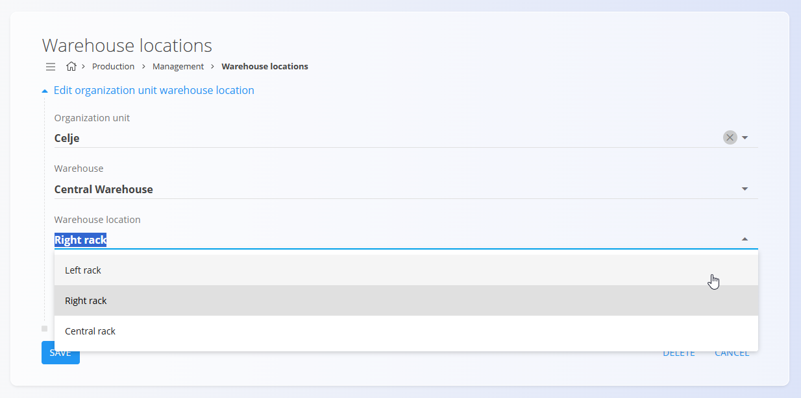

# Warehouse locations

The **Warehouse locations** list maps Production organization units to physical warehouse locations so
production workflows can source materials and store produced items. Use this page to manage which
locations Production may use for input and output and to enforce connection rules between
organization units and warehouse locations.

To access Warehouse locations, go to **Production / Management / Warehouse locations** in the  
[navigation](../../Common/UI/Navigation.md).

## Schema

| Field | Description |
|-------|-------------|
| [**Organization unit**](../../Common/CodeLists/OrganizationUnits.md) | Reference to the Production organization unit (mandatory). |
| [**Warehouse**](../../Logistics/CodeLists/Warehouses.md) | Warehouse where the physical location exists (mandatory). |
| [**Warehouse location**](../../Logistics/CodeLists/Locations.md) | Physical location (aisle / rack / level / bin) (mandatory). |
| **Connection type** | Type of connection: `Input` or `Output` (mandatory). Determines how Production uses the location. |

## Management

Open this screen to view, add, edit and delete Production-specific warehouse locations for
organization units.

### Warehouse locations list

The list displays the `Organization unit`, `Warehouse location` and `Connection type`. Use the
search box in the header to find records.

Click an `Organization unit` name to open the edit form for that record. The floating Action
Button shows a small menu with **Import** and **New**.

## Actions

Click the [**Action Button**](../../Common/UI/ActionButton.md) and choose **New** to add a location.

### Add new

Fill in the fields shown on the form:

- [**Organization unit**](../../Common/CodeLists/OrganizationUnits.md) — select from `OrganizationUnits`  
- [**Warehouse**](../../Logistics/CodeLists/Warehouses.md) — select from `Warehouses`  
- [**Warehouse location**](../../Logistics/CodeLists/Locations.md) — select from `Locations`  
- **Connection type** — choose `Input` or `Output`

Click **Add** to save the record.

#### Special behaviours / notes (validation and constraints)

- A single [**Warehouse location**](../../Logistics/CodeLists/Locations.md) cannot be assigned as both `Input` and `Output` for the same
  [**Organization unit**](../../Common/CodeLists/OrganizationUnits.md). The UI prevents selecting the same location for both roles.  
- Only one `Output` connection is permitted per [**Organization unit**](../../Common/CodeLists/OrganizationUnits.md). Adding a second
  `Output` for the same unit is blocked by validation.  
- `Organization unit`, `Warehouse` and `Warehouse location` are sourced from their respective
  code lists; keep those lists in sync with Logistics and Common domains.

### Edit

Click an `Organization unit` name in the list to open the edit form. Fields behave the same as on New.
Validation prevents invalid combinations as described above.

### Import

Use **Import** from the Action Button menu to bulk-create records. Follow the project import
template for CSV structure.

## Deletion

Click **Delete** on the edit screen to open a confirmation dialog:

**Are you sure you want to delete this record?**

If confirmed, the record is permanently removed from the Production Warehouse locations list;
otherwise the system keeps the record unchanged.

> [!NOTE]  
> Deleting a record removes the mapping only from the Production configuration. The referenced
> Warehouse and Warehouse location remain intact in the Logistics domain and are not deleted.

---