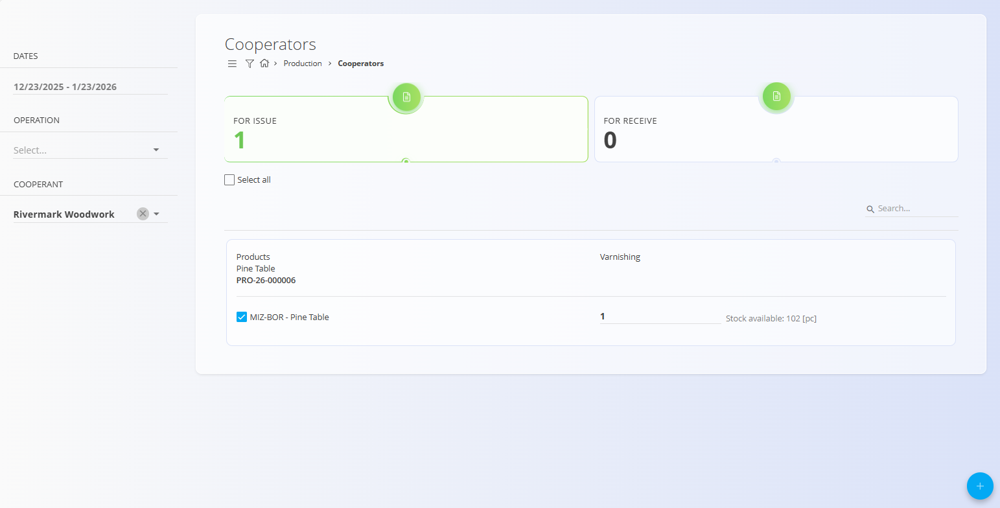
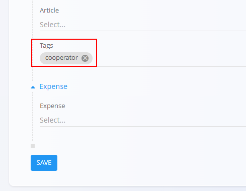

# Cooperators

Cooperators are external companies (defined in the [**Business directory**](../../Common/Management/BusinessDirectory.md)) that can perform specific operations related to **Production** or **Maintenance** orders.

- In the Business directory, mark partners with the **Cooperator** role so they can be selected here.
- Operations intended for outsourcing must be tagged as `cooperator` (see Prerequisites below).

This screen provides a dedicated workflow for issuing materials to cooperators and receiving them back once the external operation is completed.

To access this screen, go to **Production → Cooperators** in the [navigation](../../Common/UI/Navigation.md).

## Prerequisites

To make an operation available for cooperators:

- The operation must belong to a **[Production order](ProductionOrders.md)** or the **Maintenance** domain (see [Maintenance domain](../../Maintenance/Domain/MaintenanceDomain.md)).
- In the operation creation or editing form, the tag `cooperator` must be assigned.
- The external company must exist in the [**Business directory**](../../Common/Management/BusinessDirectory.md) with the role **Cooperator** enabled.

Only operations tagged as `cooperator` will appear on the **Cooperators** screen.

> [!TIP]
> If an expected operation does not appear, verify:  1. The `cooperator` tag on the operation,  2. The order state is active   3. The operation is running on the **[Execution](Execution.md)** (click **Start**)

## Screen overview

The Cooperators screen is divided into two main indicators at the top:

- **For issue** – operations waiting to be issued to a cooperator
- **For receive** – operations waiting to be received back from a cooperator

Each indicator can be clicked to display the corresponding list. Use the left sidebar filters to narrow the list by:
- Date range
- Operation
- Cooperator (external company)

### Operator view (Execution)

When an operator opens an operation that requires an external cooperator, the [**Execution**](Execution.md) screen clearly shows that the step is handled externally. 

He can now click **Start** to begin the operation. Once started, the operation appears in the **For issue** list on the **Cooperators** screen.

> [!NOTE]
> Unstarted operations do not enter the outsourcing workflow lists.

## For issue

The **For issue** view shows operations that are ready to be sent to an external cooperator.

Typical workflow:

1. Select one or more operations from the list.
2. Select a **Cooperator** in the left sidebar (taken from the [**Business directory**](../../Common/Management/BusinessDirectory.md)).
3. Click the [**action button**](../../Common/UI/ActionButton.md).
4. Choose one of the available actions:
   - **Create [Delivery note](../../Sales/Documents/DeliveryNotes.md)**
   - **Add to existing [Delivery note](../../Sales/Documents/DeliveryNotes.md)**

After selecting an option, the standard flow continues through:

**[Delivery note](../../Sales/Documents/DeliveryNotes.md) → [Issue](../../Logistics/Documents/Issues.md)**

Once the material is issued, the operation is removed from the For issue list.

> [!EXAMPLE]
> **Example:** 
>
> You use the services of an outside company to varnish your tables. In **For issue**, select the varnishing operation for the Pine table, choose your cooperator, create a **Delivery note**, then create a full **Issue**. The tables are shipped out and the operation moves to the **For receive** list.

## For receive

After the material has been issued, the operation appears in the **For receive** view.

From here, the workflow is reversed:

1. Select the operation.
2. Click the [**action button**](../../Common/UI/ActionButton.md).
3. Create a new **[Supply order](../../Supply/Documents/SupplyOrders.md)** (to record the vendor service and return logistics). 
4. Follow the standard flow:
   **[Supply order](../../Supply/Documents/SupplyOrders.md) → [Receive](../../Logistics/Documents/Receives.md)**

After the material is received, the operation is no longer pending.

> [!EXAMPLE]
> **Example:**
> 
> The varnished Pine tables are ready to be returned from the cooperator. You create a **Supply order** for the varnishing service, then a **Receive** to bring the tables into stock. The operation disappears from **For receive**.

## Completing the operation

Once the returned material is available:
- The operator can open the operation in **[Execution](Execution.md)** and proceed as usual (produce, record losses/downtime, confirm checklists).
- When finished, he can stop and complete the operation.

After completion:
- The operation is no longer visible in the **Cooperators** screen.
- The cooperator workflow for that operation is finished.

## Practical tips and traceability

- Document links: Use the Linked/Connections sections on **[Delivery notes](../../Sales/Documents/DeliveryNotes.md)**, **[Issues](../../Logistics/Documents/Issues.md)**, **[Supply orders](../../Supply/Documents/SupplyOrders.md)**, and **[Receives](../../Logistics/Documents/Receives.md)** to navigate the full chain.
- Organization units: Ensure the correct **[Organization unit](../Management/OrganizationUnits.md)** is selected on the order so workers see the operation in **[Execution](Execution.md)** after receiving.