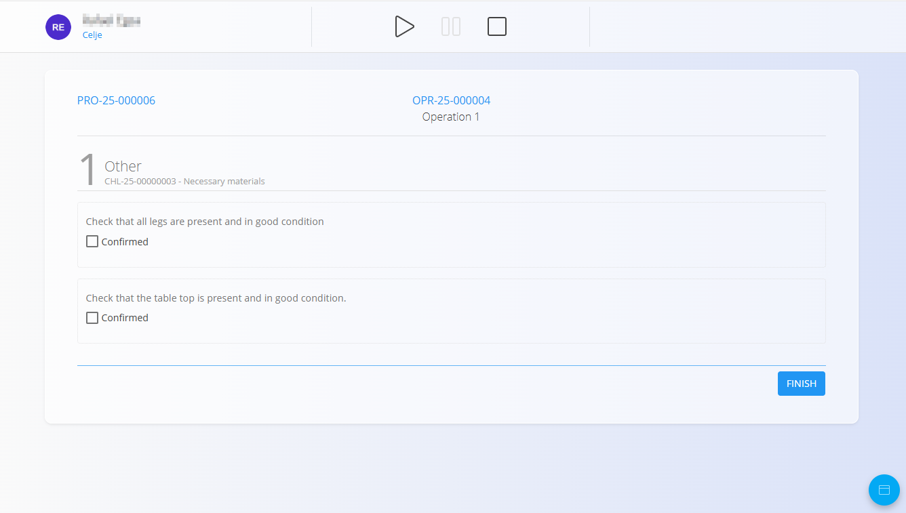
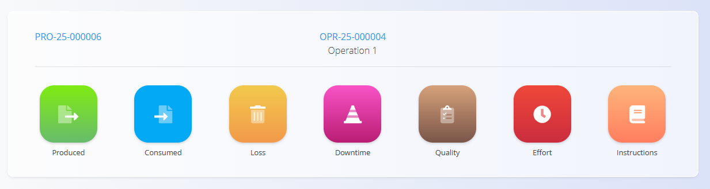
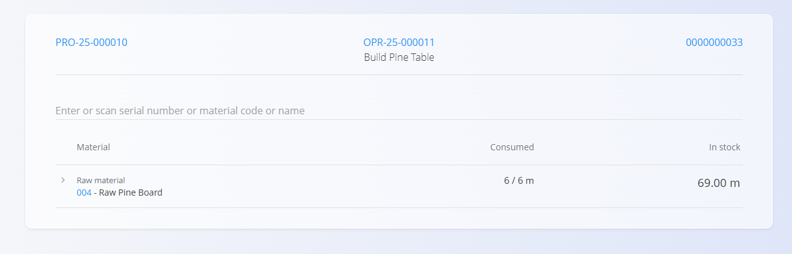
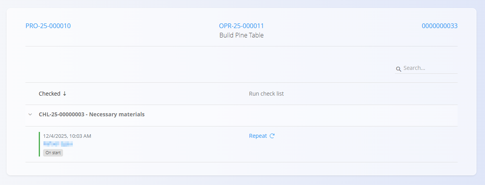

# Execution

The **Execution** module is used by production workers to perform and record work on assigned production orders.  It provides real-time tracking of progress, produced quantities, downtime, losses, checklists, and other activities.

Most production workers are automatically redirected to the Execution view upon login.

> [!TIP]
> For a full demonstration, see the **[executions](https://www.youtube.com/watch?v=qf0Ftar4hAg&list=PLH4LYaWds6h8kspUco0t_MaFPNbL0zj1D&index=28)** video tutorial.

To access this page manually, go to **Production / Execution** in the [**navigation**](../../Common/UI/Navigation.md).

## Execution interface overview

The main execution screen displays all relevant information for the current production order and operation.

| No. | Description |
|-----|-------------|
| **1** | Logged-in user and **organization unit**.  • Click user image → logout  • Click organization unit → change it (see [Organization Units](../CodeLists/OrganizationUnits.md)) |
| **2** | Operation control buttons:  • **Start** – begins the operation  • **Pause** – temporarily suspends work  • **Stop** – completes the operation |
| **3** | Shortcuts:  • **Yellow bin** – record defective items  • **Orange triangle** – view open bottlenecks or issues |
| **4** | Current production order |
| **5** | Current operation |
| **6** | Batch / lot information |
| **7** | Current output of the operation and label printing |
| **8** | Production progress (produced / planned) |
| **9** | Current recorded losses |
| **10** | Quantity remaining to complete the production task (editable) |
| **11** | **Produce** button — records produced quantity |
| **12** | Activity (action) button leading to the activity selection page |

### Operation controls

## Execution process 

### Starting production

An operation can be started in two ways:

#### **1. Press Start**
The worker clicks **Start**, and the operation begins.

#### **2. Press Produce (starts automatically)**
If the worker presses **Produce**, the system:

- Automatically starts the operation (even if the worker does not change the quantity)  
- Records the quantity shown above the button  
- Updates the remaining quantity
- If the default number is the total planned quantity and the worker does not modify it, the system will record **all remaining pieces as produced**.
  
  

### Pausing production

Press **Pause** to temporarily suspend temporarily the operation. This does **not** complete production — it only pauses it until resumed.

### Stopping / finishing production

Press **Stop** to finish the current operation.

Normally, workers press **Stop** when all items are produced and all checklists, losses, and records are completed.

If stopped early (e.g., 1/3 produced), the operation completes with partial production.

Once all operations in the production order are finished, the [**Production order**](ProductionOrders.md) moves to the **Closed** status.

### Checklists and quality controls

If there are any quality checklists assigned to the operation, they must be completed at their assigned stage of the process (at start, at completion, etc.). They appear automatically when required.

Workers must confirm each step as defined in the checklist.

> [!NOTE]
> When the worker attempts to stop the operation, the system checks for any incomplete quality tasks and prompts the worker to complete them first.

## Action menu and activities

The floating [**action button**](../../Common/UI/ActionButton.md) in the bottom-right corner opens the activity selection menu.

From here, the worker can choose:

- **Produced** – open the main execution screen  
- **Consumed** – record input consumption  
- **Loss** – record defective or unusable items  
- **Downtime** – record time losses and interruptions  
- **Quality** – review and complete quality checklists  
- **Effort** – record working time  
- **Instructions** – view operation instructions  

Each option is described below.

### Produced (main production screen)

The **Produced** option returns to the main execution screen where items are recorded.

On this screen, the worker can:

- Enter the quantity in the number field above **Produce**  
- Click **Produce** to record the entered quantity  
- See **Produced / Planned** and **Remaining** quantities update in real time  

If production is already in progress, additional clicks on **Produce** continue to add to the produced quantity.

### Consumed

The **Consumed** option is used to record input consumption for the current operation.

On this screen, the worker can:

- Enter or scan a **serial number**, **material code**, or **material name**  
- Select the correct material from the list  
- Enter the quantity consumed  

The system shows, for each material:

- **Consumed** – quantity already recorded for this operation  
- **In stock** – available quantity in inventory  

### Loss

The **Loss** option is used to record defective or unusable items.

Workers can:

- Enter the defective quantity  
- Select a **Loss classification** (for example, a cosmetic defect) from [Loss classification tags](../CodeLists/LossClassificationTags.md)  
- Save the entry by clicking the **Loss** button

Each loss entry can later be edited and tagged as required.

### Downtime

The **Downtime** section allows workers to record interruptions during production.

Workers can:

- Record start and end time  
- Add downtime tags (from [Downtime tags](../CodeLists/DowntimeTags.md))  
- Assign equipment  
- Edit or delete downtime entries  

Example downtime editing screen:

### Quality

If quality [checklists](../CodeLists/CheckLists.md) were linked to the process or operation, they appear under **Quality**.

For each checklist, there is a **status color** on the left:  
  - Green when everything is completed and confirmed  
  - Red if something is missing or not confirmed  

If needed, the **Repeat** option allows the checklist to be run again.

### Effort

Workers can record the time spent on an operation either **manually** or using **Start / Stop** tracking.

- **Start / Stop** — begins or ends real-time tracking of work.
- **Manual entry** — workers can enter:
  - Date  
  - Start / End time  
  - Duration  
  - Tags (optional)  
  - Description  

Click **Add effort** to save the record.

> [!NOTE]
> The **Stop** button inside the Effort page finishes the effort's **time tracking only**; it does not finish the **operation**.

Recorded efforts appear in a list below the form:

Each entry can be **edited** or **deleted** by selecting it from the list.

### Instructions

The **Instructions** option displays any articles from the **Knowledge base** attached to the operation, such as:

- Assembly instructions  
- Safety procedures  
- Visual guidelines  
- Additional notes or warnings  

Instruction content is managed in **[Operations](../CodeLists/Operations.md)** in the **Article** field.

## Completion of execution

Once all production is completed:

1. All required quantities are produced  
2. All losses and downtimes are recorded  
3. All quality checkpoints are completed  
4. The worker clicks **Stop**

The operation switches to **Finished**, and when all operations in the production order are finished, the **Production order** moves to the **Closed** status.

---
