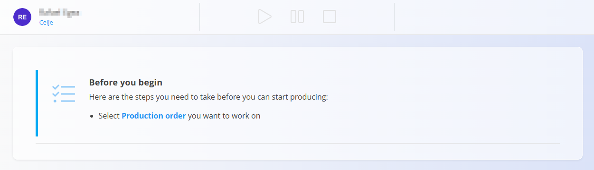
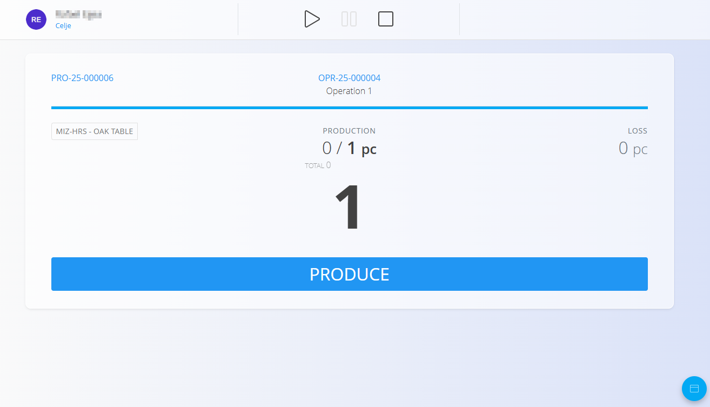

# Execution – Quick User Guide

This guide shows the **essential steps** to perform production using the Execution screen.

## 1. Select your production order

When you open **Execution**, select the production order and operation you will work on.  
If nothing is selected, the screen will prompt you to choose a **Production order**.

## 2. Start the operation

You can start work in two ways:

### Option A — Press Start
Tap **Start** to begin timing and working on the operation.

### Option B — Press Produce
Pressing **Produce** will **automatically start the operation**, even if you don’t change the quantity.

## 3. Produce items

1. Enter the number of items you produced (e.g., **1**).  
2. Press **Produce**.  
3. The system updates:  
   - Produced quantity  
   - Remaining quantity  

Repeat whenever more items are completed.

> **NOTE**  
> Review **Instructions** if they appear or whenever needed:  
> - Tap **Instructions** to view assembly steps, visuals, or operation-specific notes.

## 4. Record losses (defective items)

1. Tap **Loss**.  
2. Enter the defective quantity.  
3. Select the loss reason.  
4. Confirm.

## 5. Record consumed materials

Use this when materials are used during the operation:

1. Tap **Consumed**.  
2. Scan, type, or select the material.  
3. Enter the quantity consumed.  
4. Confirm.

## 6. Record downtime (interruptions)

1. Tap **Downtime**.  
2. Choose the reason for the interruption.  
3. Adjust the times if necessary.  
4. Save.

Use this for any interruption, such as waiting for materials or machine issues.

## 7. Complete quality checklists

If a checklist appears:

1. Follow the listed steps.  
2. Confirm each checkpoint.  
3. Tap **Repeat** if the checklist needs to be performed again.

You cannot stop the operation if required checklists are incomplete.

## 8. Record effort (working time)

Only if required by your workflow.

### Automatic:
Tap **Start** → work → tap **Stop**.

### Manual:
Open **Effort**, then enter:  
- Date  
- Start/end time or duration  
- Notes (optional)  

Save the entry.

Recorded efforts appear below:

## 9. Finish the operation

When all production work is completed:

1. Verify produced quantity.  
2. Record any losses, downtime, consumed materials, or checklists.  
3. Tap **Stop** to finish the operation.

---
