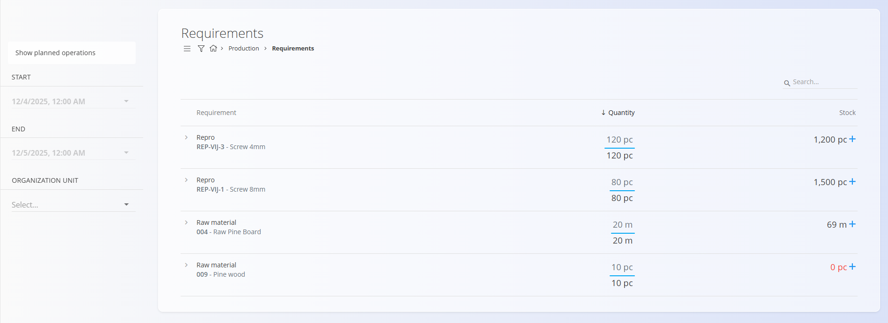
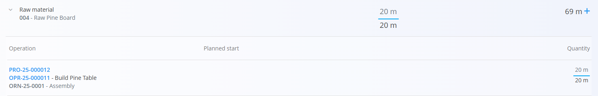
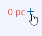

# Requirements

The **Requirements** page provides an overview of all materials needed for planned production operations within a selected time window. It helps planners understand whether enough stock is available and quickly create purchase orders when shortages appear.

> [!TIP]  
> For a full demonstration, see the **[Requirements](https://www.youtube.com/watch?v=eK7ui-ak7J0)** video tutorial.

To access this page, go to **Production / Requirements** in the [**navigation**](../../Common/UI/Navigation.md).

## Schema

| Column | Description |
|--------|-------------|
| **Requirement** | The material name and code. You can expand each material to see which operations consume it. |
| **Quantity** | Shows two values: • **Interval quantity** — required quantity within the selected date range (upper value) • **Total quantity** — full planned consumption for all operations using that material (lower value) |
| **Stock** | Current available stock.  • If stock is lower than required, it appears in **red**.  • Clicking the **+** icon opens a window to create a **new supply order**. |

## Requirements list

Each line represents a **material requirement** based on inputs defined in processes and production orders.

### Filters

Filters appear on the left side of the screen and allow you to adjust which planned operations are included in the calculation.

- **Show planned operations** – When enabled, requirements are calculated based only on planned (not yet executed) operations.  
- **Start / End** – Defines the date interval used to calculate required quantities.  
- **Organization unit** – Filters requirements by organizational unit.

Only materials required by operations that fall within the selected time and organizational unit range are included.

### Viewing consumption details

Click the expand arrow next to a material to display all operations that use it:

For each operation, the following is shown:

- **Operation code and name**  
- **Planned start** date  
- **Quantity consumed** by that operation  

This allows planners to understand *which* production tasks drive consumption.

## Creating a supply order

When stock is insufficient, the **Stock** column displays the number in red along with a **+** button:

Clicking **+** opens the supply order creation form, pre-filled with the selected material.

This provides quick replenishment directly from the Requirements screen.

## Summary

The Requirements page helps planners:

- See **which materials are needed** for upcoming production  
- Compare **required vs. available** quantities  
- Drill into **which operations** consume each material  
- Quickly create **supply orders** when stock is insufficient  

