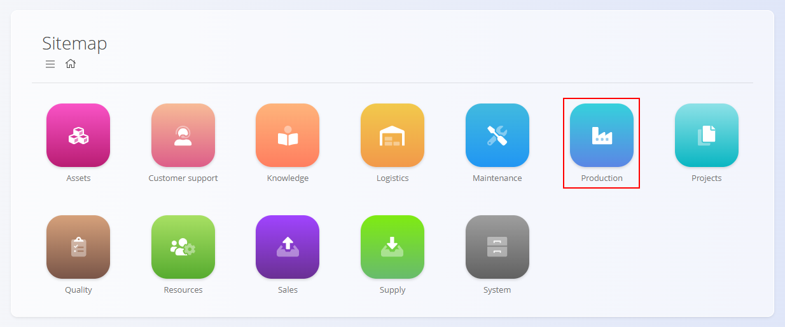
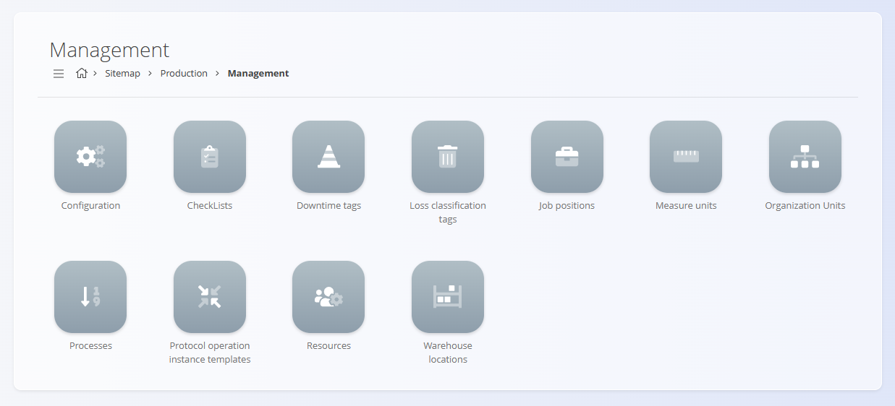

# Production

The **Production** domain manages all processes related to manufacturing, shop-floor execution, and production analysis. It includes tools for planning and issuing production orders, executing operations, tracking consumption and production, and reviewing performance analytics.

Where the **[Supply](../../Supply/Domain/SupplyDomain.md)** domain ensures material availability, the Production domain ensures that these materials are transformed into finished or semi-finished goods through controlled and traceable workflows.

To access Production, navigate to **Production** in the [navigation](../../Common/UI/Navigation.md).

> [!NOTE]  
> The availability of production features depends on the company’s manufacturing configuration, processes, and resource setup.

## What is included in the Production domain?

The domain is organized into the following functional areas:

- **[Production orders](../Documents/ProductionOrders.md)** – definition and execution of manufacturing work  
- **[Execution](../Documents/Execution.md)** – real-time shop-floor activity reporting  
- **[Requirements](../Documents/Requirements.md)** – aggregated material needs for planned production  
- **[Analytics](#analytics)** – insights into downtime, performance, loss, OEE, and KPIs  
- **[Management](#management)** – configuration, process design, and master data  

## Production orders

The **[Production orders](../Documents/ProductionOrders.md)** section contains the core documents used to plan and execute manufacturing. It provides definition of what needs to be produced, based on which process version, in what quantity, and under which conditions.

Production orders move through the life cycle **Draft → Pending → Active → Closed** and form the basis of all execution activity.

## Execution

The **[Execution](../Documents/Execution.md)** module is used by production workers to perform real-time reporting: produced quantities, consumed materials, downtimes, losses, checklists, and effort.

Execution ensures accurate data collection, enabling reliable analytics and traceability.

## Requirements

The **[Requirements](../Documents/Requirements.md)** page aggregates all planned material inputs across production orders within a selected period. It displays:

- Required vs. available material quantities  
- Requirements grouped by material  
- Direct links to production orders and operations that consume those materials  

## Analytics

The **Analytics** section provides insight into production performance, downtime, quality, loss distribution, and OEE.

Available analytical views include:

- **[Downtime summary](../Analytics/DowntimeSummary.md)**  
- **[Equipment summary](../Analytics/EquipmentSummary.md)**  
- **[Production KPIs](../Analytics/ProductionKPIs.md)**  
- **[Loss summary](../Analytics/LossSummary.md)**  
- **[Organization unit downtime](../Analytics/OrganizationUnitDowntime.md)**  
- **[Organization unit loss](../Analytics/OrganizationUnitLoss.md)**  

These insights support production planning, continuous improvement, and operational decision-making.

## Management

The **Management** section contains configuration, process definitions, and production-related code lists required for smooth operation.

Available configuration and code lists include:

- **Configuration** – global production settings  
- **[Checklists](../CodeLists/CheckLists.md)**  
- **[Downtime tags](../CodeLists/DowntimeTags.md)**  
- **[Loss classification tags](../CodeLists/LossClassificationTags.md)**  
- **[Job positions](../CodeLists/JobPositions.md)**  
- **[Measure units](../../Common/CodeLists/MeasureUnits.md)**  
- **[Organization units](../CodeLists/OrganizationUnits.md)**  
- **[Processes](../CodeLists/Processes.md)**  
- **[Protocol operation instance templates](../CodeLists/ProtocolOperationsInstanceTemplates.md)**  
- **[Resources](../CodeLists/Resources.md)**  
- **[Warehouse locations](../CodeLists/WarehouseLocations.md)**  

These elements define how production behaves: resource availability, process structure, operation setup, quality checks, and analytics classification.

## Production process lifecycle

Production activities typically follow this sequence:

### **1. Process design**  
Processes and versions are configured, including operations, inputs, outputs, resources, and checklists.

### **2. Production order creation**  
A production order is created based on product demand or planning.

### **3. Execution**  
Workers report real-time progress, downtimes, losses, and material consumption.

### **4. Completion**  
Operations finish, results are recorded, and the production order closes.

### **5. Analysis**  
Analytics provide insight into efficiency, quality, downtime causes, and resource performance.

## Production and other domains

Production integrates with several other operational domains:

| Area | Interaction |
|------|-------------|
| **[Materials](../../Assets/Domain/Materials.md)** | Defines what is being produced and consumed. |
| **[Supply](../../Supply/Domain/SupplyDomain.md)** | Provides materials needed for production. |
| **[Logistics](../../Logistics/Domain/LogisticsDomain.md)** | Handles warehouse movements of consumed and produced items. |

## Summary

The Production domain manages all manufacturing activities—planning, executing, tracking, and analyzing production. It ensures structured workflows, accurate operational data, and complete traceability from process definition to finished goods.

---
