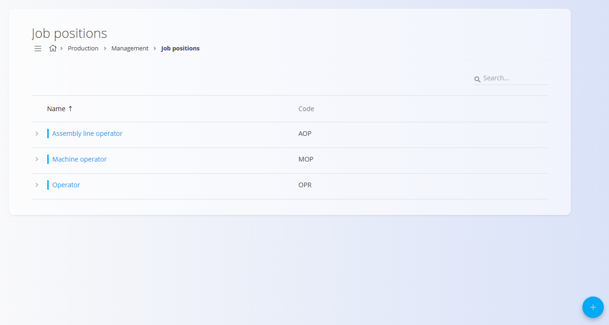
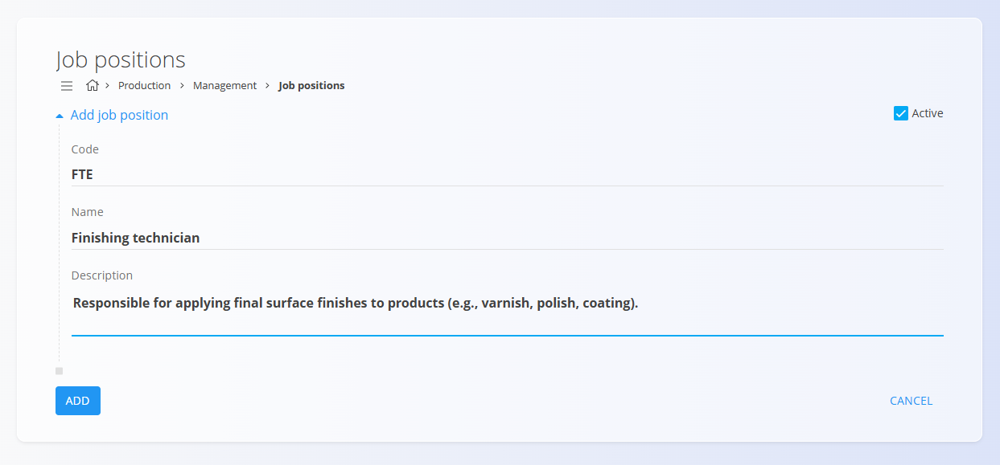

# Job positions

The **Job positions** code list defines the roles that employees can perform across operational workflows (production and maintenance). These positions are assigned to registered workers in the system, so they can be selected in workflows such as work reports, scheduling, resource assignment, and checklist execution permissions.

To access Job positions, navigate to the **Production** or **Maintenance** domains, then go to **Management / Job positions** in the [**navigation**](../../Common/UI/Navigation.md).

## Schema

| Field | Description |
|-------|-------------|
| **Code** | Unique identifier of the job position (mandatory). |
| **Name** | Human-readable name of the role (mandatory). |
| **Description** | Optional explanation of the responsibilities associated with this position. |
| **Active** | Indicates whether the position can be assigned to users. |

## Management

From this screen, you can view, add, and edit job positions used across Production and Maintenance.

### Job positions list

The list displays all recorded job positions, showing their **name** and **code**.

Each record includes a status indicator to the left of its name:
- **Blue** indicates the position is active  
- **Gray** indicates the position is inactive  

To view or assign workers to a position, first expand the record by clicking the arrow on the left side of the row. This reveals the **Add user resource** option.

Clicking **Add user resource** opens a dialog where you can select one or more existing system users to assign to the job position.

## Actions

Click the [**Action Button**](../../Common/UI/ActionButton.md) to add a new job position.

### Add new job position

Fill in the required information:

- **Code**  
- **Name**  
- **Description** (optional)  
- **Active**  

Click **Add** to save the new position.

## Deletion

Click **Delete** on the edit screen to remove a job position. If confirmed, the record is permanently deleted.

> [!NOTE]  
> Job positions can be deleted freely, even if users are assigned to them.

