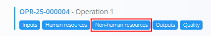
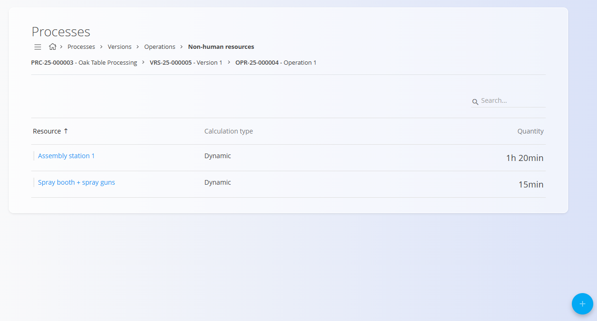
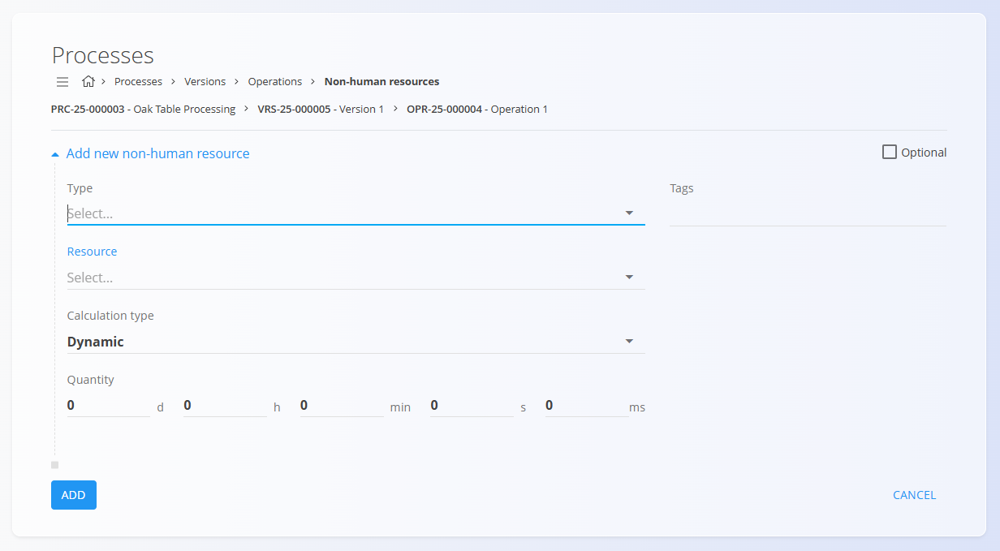

# Non-human resources

Non-human resources define which machines, tools, equipment, or resource groups are required to execute a specific operation in a process. Each entry represents planned usage time for a technical or physical resource.

To access this page, open a process version from **Production / Management / [Processes](Processes.md)**, click [**Operations**](Operations.md), then select **Non-human resources** for a specific operation.

> [!TIP]
> For a full demonstration, see the **[Human and Non-human resources](https://www.youtube.com/watch?v=iq7fQiPh_i4)** video tutorial.

## Schema

| Field | Description |
|-------|-------------|
| **Type** | Defines what kind of non-human resource is used:  • [**Resource**](../Management/Resources.md) • **Resource category** |
| [**Resource**](../Management/Resources.md) | The specific resource or resource category selected based on the chosen **Type**. |
| **Calculation type** | Defines how the planned time is calculated.  • **Dynamic** – time is calculated according to production quantity or other process parameters.  • **Dynamic by batch** – time is calculated according to a specific batch.  • **Static** – Quantity is fixed. |
| **Quantity** | Planned usage time for the resource, entered as a duration (days, hours, minutes, seconds, milliseconds). |
| **Tags** | Optional labels used to categorize or filter non-human resource assignments. |
| **Optional** | When enabled, the resource is not strictly required for the operation to be executed. |

## List view

The Non-human resources list shows all resource assignments for the selected operation, including:

- **Resource** – name of the machine, tool, equipment, or resource group  
- **Calculation type**  
- **Quantity** – planned duration  

Use the **Search** bar to filter by resource name.

## Creating a new non-human resource entry

1. Click the [**action button**](../../Common/UI/ActionButton.md) in the bottom-right corner and choose **New** (or a copy option, if available).
2. Fill in the fields:

   

3. Click **Add** to save the entry.

## Editing a non-human resource entry

1. Click a resource row in the list to open the Edit page.  
2. Adjust **Type**, **Resource**, **Calculation type**, **Quantity**, **Tags**, or **Optional** as needed.  
3. Click **Save**.

## Deletion

A non-human resource entry can be deleted from its Edit page by clicking **Delete**. If confirmed, it is removed from the operation.

