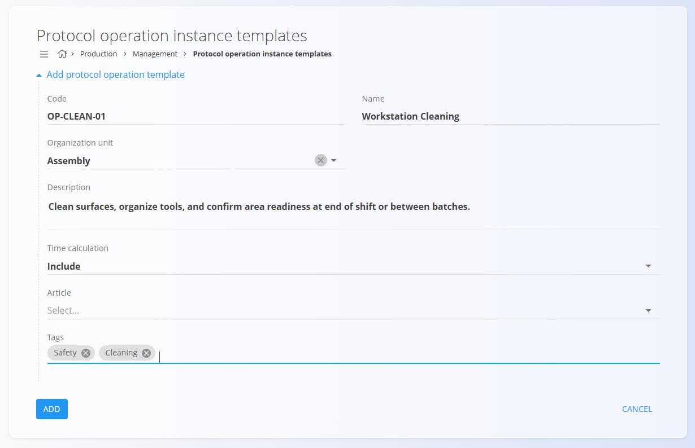

# Protocol operation instance templates

Protocol operation instance templates define reusable operation blueprints that can be quickly inserted into processes. They help standardize naming, descriptions, time-calculation behavior, tags, and other operation attributes across the system for both **Production** and **Maintenance** workflows (e.g., assembly step, inspection, calibration).

To access this page, go to **Production / Management / Protocol operation instance templates** in the [navigation](../../Common/UI/Navigation.md). Templates are shared and can be used when building operations in process versions.

> [!TIP]
> For a full demonstration, see the **[Operation templates](https://www.youtube.com/watch?v=Cm8RYdO0f6E)** video tutorial.

## Schema

| Field | Description |
|-------|-------------|
| **Code** | Unique identifier of the template. |
| **Name** | Template name shown when selecting an operation template. |
| **Organization unit** | The organizational unit for which the template is intended (e.g., production line or maintenance team). See [**Organization units**](OrganizationUnits.md). |
| **Description** | Text describing what the operation involves and when it should be used. |
| **Time calculation** | Defines whether the template’s time should be *included* or *excluded* in the total operation duration. |
| **Article** | Optional article used to attach instructions to the template. See the **[Knowledge base](../../Knowledge/KnowledgeBase/KnowledgeBase.md)** for authoring instructions. |
| **Tags** | Classification labels that help categorize templates (e.g., Production, Maintenance). |

## Management

The page lists all protocol operation instance templates, displaying:

- **Code and Name**
- **Organization unit**
- **Description**
- **Tags**

Templates help ensure consistency when defining operations in process versions.

Clicking a row opens the template for editing.

## Adding a new template

Click the [**action button**](../../Common/UI/ActionButton.md) and choose **Add protocol operation template**.

Fill in the following fields:

- **Code**  
- **Name**  
- **Organization unit**  
- **Description**  
- **Time calculation**  
- **Article** (optional)  
- **Tags**  

Click **Add** to save the template.

## Editing a template

Select any template from the list to open its detail page.

You may adjust:

- Name  
- Organization unit  
- Description  
- Time calculation  
- Article  
- Tags  

Click **Save** to apply changes.

## Using templates when creating operations

Protocol operation instance templates can be selected directly when adding new operations to a process version.

To use a template:

1. Open a process version  
2. Go to **Operations**  
3. Click the **action button** → **By template**  
4. Choose a template from the **Operation template** dropdown menu

The system automatically fills in the predefined fields from the template.

You can still modify any field before saving the operation.

## Deletion

Use the **Delete** option inside the template edit page.

