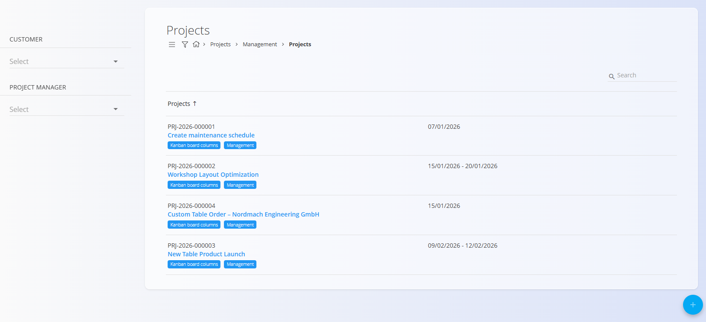
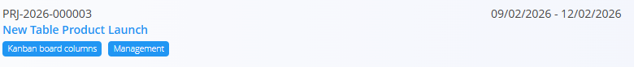
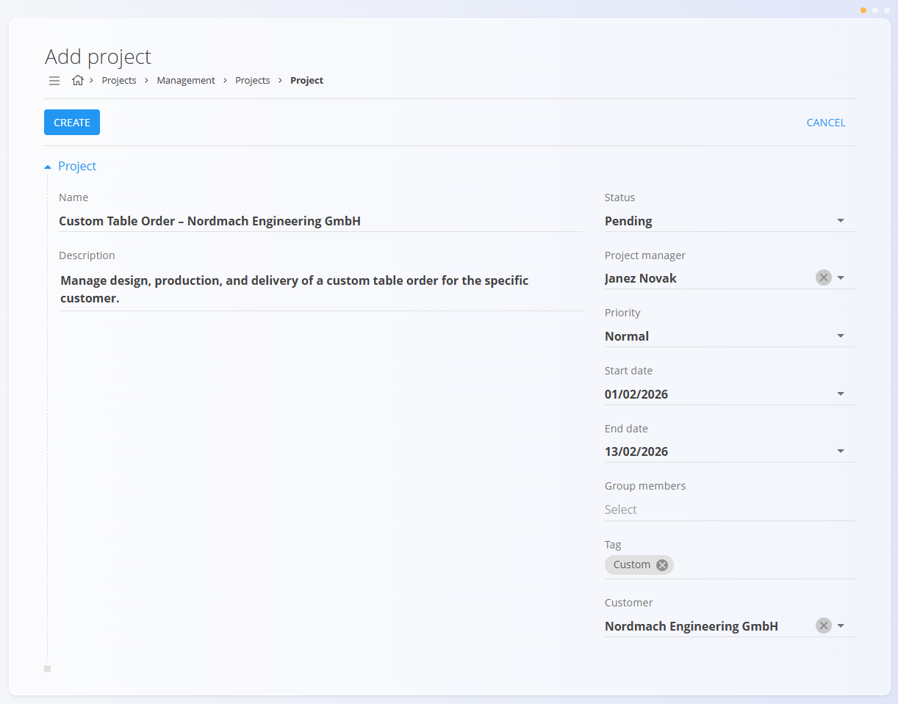
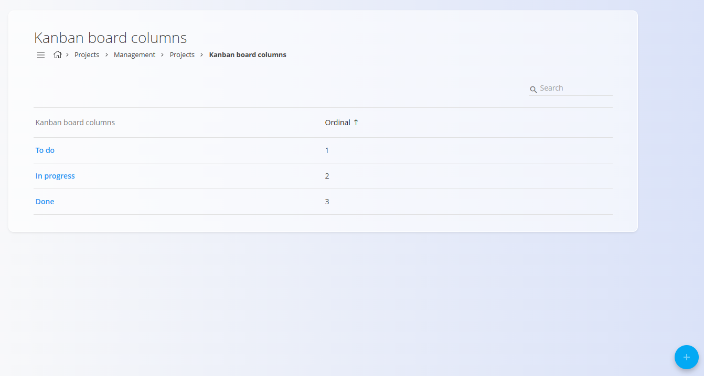
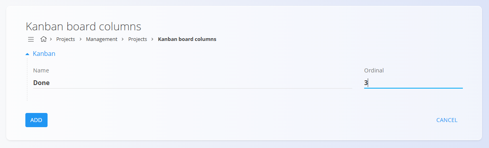
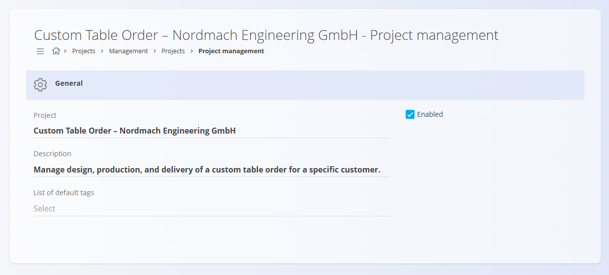

# Project Management

Project management is used to **create, configure, and maintain projects** in TomPIT. Projects define a structured container for tasks, timelines, responsibilities, and progress tracking, and can be visualized using **Kanban boards**.

To access project management, go to **Projects / Management / Projects** in the [**navigation**](../../Common/UI/Navigation.md).

## Schema

| Field             | Description                                 |
|-------------------|---------------------------------------------|
| **Name**          | Project name (required)                     |
| **Description**   | Short description of the project             |
| **Status**        | Current project status (Pending, Active, Closed)       |
| **Project manager** | Responsible person                        |
| **Priority**      | Project priority                            |
| **Start date**    | Planned start date                          |
| **End date**      | Planned end date                            |
| **Group members** | Users involved in the project               |
| **Tag**           | Optional classification                     |
| **Customer**      | Customer associated with the project        |

## List view

The Projects list displays all projects created in the system. Each row shows:
- **Project code and name**
- **Planned date range**
- Assigned **tags**
- Access to **Kanban board columns** configuration
- Access to **project management** (edit screen)

### Filters

On the left side of the list, you can filter projects by:
- **Customer** (dropdown)
- **Project manager** (dropdown)

The search field allows filtering by project code or name.

## Actions

Click the [**action button**](../../Common/UI/ActionButton.md) to create a new project.

When creating or editing a project, the fields described in the [**Schema**](#schema) section above are available.

Click **Create** to save the project.

## Editing a project

Click on a project in the list to open the edit screen, with all the same fields as when creating a new project.

When you are done editing, click **Save** to apply the changes.

## Kanban board columns

Each project can define its own **Kanban board columns**, used to track task progress visually. Kanban columns are **project-specific**.

To manage Kanban columns:
1. Open the **Projects** list
2. Click **Kanban board columns** on the desired project

From the Kanban board columns screen you can:
- Add new columns
- Edit existing column names
- Define the column order using the **Ordinal** value

Kanban columns are applied only to the selected project and are used when working with project tasks:
- Kanban columns define the workflow stages for tasks
- They control which values are available in the task **Status** dropdown menu

## Management screen

Click on the **Management** button to open the Management screen.

From this screen you can:
- Edit project details
- Enable or disable the project
- Manage default tags
- Access Kanban board configuration
- Delete the project

## Deletion

Projects can be deleted from the **project management** screen. When deleting a project, a confirmation dialog is displayed:

*Are you sure you want to delete record?*

Once deleted, the project is permanently removed.

## Related documentation

- **[Projects](../Documents/Projects.md)** — Project overview and progress tracking  
- **[Tasks](../Documents/Tasks.md)** — Managing tasks within projects   

