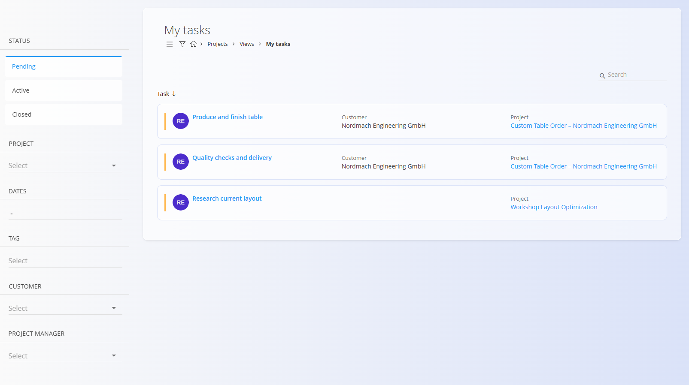

# My tasks

The **My Tasks** screen provides a personalized view of all [tasks](../Documents/Tasks.md) **assigned to you**. It is designed for workers and managers to quickly focus on their own responsibilities without navigating through all projects.

Tasks shown here always belong to a [project](../Documents/Projects.md), but the list is filtered to include only tasks relevant to the current user.

To access the **My Tasks** screen, navigate to **Projects / Views / My tasks** in the [**navigation**](../../Common/UI/Navigation.md).

## My tasks list

The list displays tasks that are assigned to you and match the selected filters.

Each task card displays:
- **Task name**
- **Customer**
- **Project**
- **Current status**

Click a task to open its **task detail view**, where you can review details, add comments, attach files, and record effort.

## Filters

The left panel allows you to filter your tasks by:

- **Status**
  - Pending
  - Active
  - Closed
- **Project**
- **Dates**
- **Tag**
- **Customer**
- **Project manager**

Filters can be combined to quickly narrow down your personal workload.

A search field in the top-right corner allows you to find specific tasks by name.

## Working with tasks

From the **My Tasks** screen, you can:

- Open assigned tasks
- Review task details
- Add comments and attachments
- Record effort and time spent
- Track task status changes

Task execution and detailed task handling behave exactly the same as in the general **Tasks** view.

For detailed information about task structure, lifecycle, and effort recording, see:
- **[Tasks](../Documents/Tasks.md)** — Detailed task execution and tracking
- **[Project management](../Management/ProjectsManagement.md)** — Project setup and configuration

---
