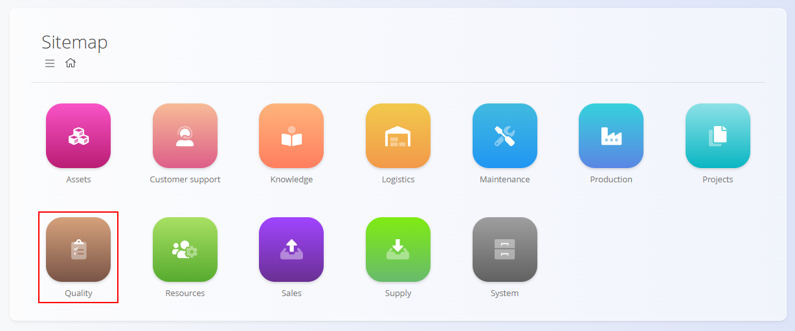

# Quality

The **Quality** domain provides a focused workspace to visualize and manage operational **checklists** used across production and maintenance. It centralizes how checklists are defined (via templates), executed by operators, and reviewed for compliance and traceability.

Use this domain to:
- Monitor active checklist executions on the shop floor or in maintenance
- Review and analyze completed checklists for compliance and continuous improvement
- Access and maintain the checklist definitions used in day-to-day operations

To access the Quality domain, navigate to **Quality** in the [navigation](../../Common/UI/Navigation.md).

> [!NOTE]
> The available domains depend on each company’s configuration and business model.

## What is included in the Quality domain?

The domain is structured into two functional areas:

- **Management** – Configure and maintain checklist definitions used by production and maintenance.
  - [**Checklists**](../../Production/CodeLists/Checklists.md) — Manage checklist templates (structure, steps, criteria, and thresholds). This is the same code list available under the Production domain and is maintained centrally there.

- **Views** – Operate and analyze real-time and historical checklist executions.
  - **Active Checklists** — View all checklists currently in progress or awaiting completion. Typical columns include checklist name, process/asset, assignee, start time, due date, and status. Common actions: open the record, continue execution, or mark as completed (subject to permissions).
  - **Completed Checklists** — Review finished checklists with outcomes, timestamps, responsible users, and any recorded nonconformities. Supports filtering (date ranges, processes, business units, results) and exporting for audits.

---