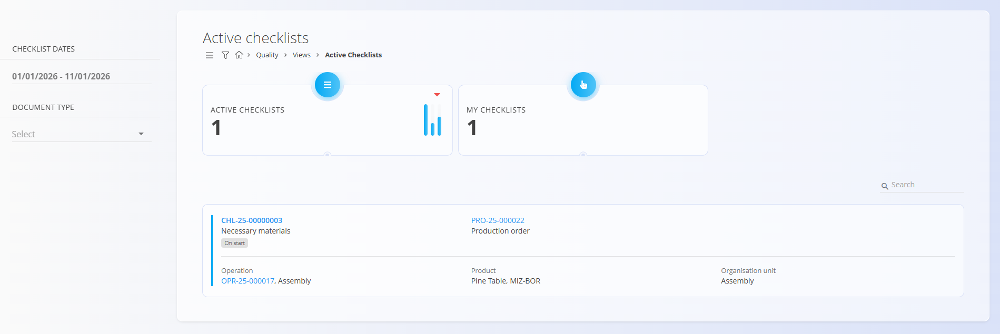

# Active checklists

The **Active checklists** view lists all checklist executions that are currently in progress. Operators use it to monitor and complete ongoing quality or maintenance tasks. When a checklist is completed, it no longer appears in this view and moves to the Completed checklists view.

To access this view, navigate to **Quality / Views / Active checklists** in the [navigation](../../Common/UI/Navigation.md).

## Overview

This view provides a real-time list of all checklists that are currently active (not completed). It is intended for shop-floor personnel, maintenance staff, and supervisors to quickly identify which checklists require attention.

At the top of the page, two indicators summarize the current state:
- **Active checklists** — total number of active checklist executions.
- **My checklists** — number of active checklist executions assigned to the currently logged-in user.

## Active Checklists list

The list shows key context for each active execution. Typical fields displayed:
- **Checklist** — code and name of the checklist being executed (e.g., `CHL-25-00000003` · Necessary materials). A status chip indicates the current phase (e.g., On start).
- **Document** — the source document type and code (e.g., Production order `PRO-26-000001`).
- **Operation** — operation code and name (e.g., `OPR-25-000017, Assembly`).
- **Product** — product name and code (e.g., Pine Table, MIZ-BOR).
- **Organization unit** — the unit responsible for execution (e.g., Assembly).

### Filters

Use filters to narrow down the list:
- **Checklist dates** — filter by start date, due date, or activity date range.
- **Document type** — limit results to a specific source document:
  - [Maintenance order](../../Maintenance/Documents/MaintenanceOrders.md)
  - [Production order](../../Production/Documents/ProductionOrders.md)

### Row interactions

- Click the **Checklist code** to open the checklist execution in the [Checklist edit](#checklist-edit) page.
- Click the **Production order code** to open the related [Production order](../../Production/Documents/ProductionOrders.md) document.
- Click the **Operation code** to open the [Production Execution](../../Production/Documents/Execution.md) page focused on the current execution.

## Checklist edit

The checklist edit page shows the current checklist **code** and **name**, followed by an overview of the checklist's checkpoints.

A typical layout includes the list of checkpoints with required inputs (confirmations, measurements, tolerances).

## Notes

- Only checklists that are actively in progress appear here; completed items are available in the Completed checklists view.
- Data refresh occurs automatically at regular intervals or when manually reloaded.

---