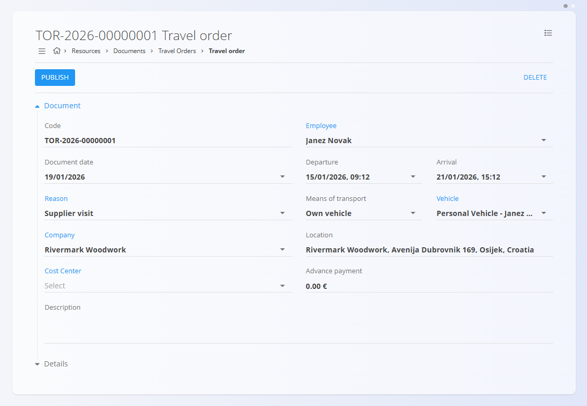
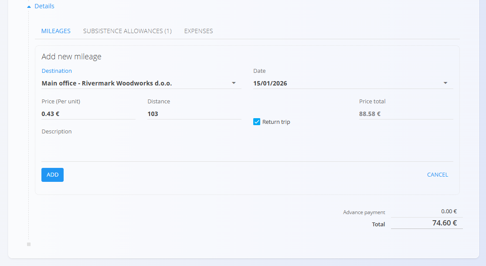
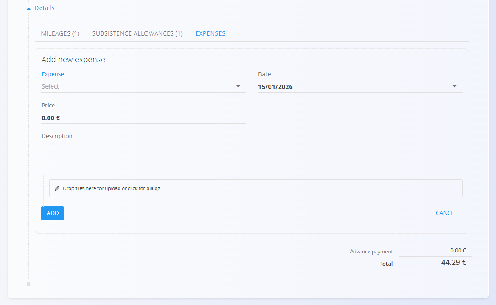

# Travel Orders

Travel Orders are used to record and manage employee business trips. They consolidate mileage, subsistence allowances, and expenses, and calculate the total trip cost.

To access this page, go to **Resources / Documents / Travel Orders** in the [**navigation**](../../Common/UI/Navigation.md).

## Schema

| Field | Description |
|------|-------------|
| **Code** | Automatically generated travel order code (read-only). |
| **Employee** | Employee for whom the travel order is created. |
| **Document date** | Date of the travel order document. |
| **Departure** | Departure date and time. |
| **Arrival** | Arrival date and time. |
| **Reason** | Travel reason sourced from the from [**Travel order reasons**](../Management/TravelOrderReasons.md) code list. |
| **Means of transport** | Transport used for the trip (e.g., own vehicle). |
| **Vehicle** | Vehicle [resource](../../Production/Management/Resources.md); only non-human resources tagged `vehicle` are available. |
| **Company** | Company selected from the business directory. |
| **Location** | Travel destination. |
| **Cost center** | Cost center assigned to the travel order. |
| **Advance payment** | Advance payment amount (optional). |
| **Description** | Additional notes (optional). |

### Mileage

| Field | Description |
|------|-------------|
| **Destination** | Destination sourced from the [**Travel destinations**](../Management/TravelDestinations.md) code list. |
| **Date** | Date of travel. |
| **Price (per unit)** | Cost per distance unit (e.g., €/km). |
| **Distance** | Travel distance. |
| **Return trip** | Indicates a return trip. |
| **Price total** | Automatically calculated mileage cost (read-only). |
| **Description** | Optional description. |

### Subsistence allowances

| Field | Description |
|------|-------------|
| **Start date** | Start date and time of the allowance period. |
| **End date** | End date and time of the allowance period. |
| [**Subsistence allowance**](../Management/SubsistenceAllowances.md) | Allowance sourced from the **Subsistence allowances** code list. |
| **Include breakfast** | Include breakfast in calculation. |
| **Include lunch** | Include lunch in calculation. |
| **Include dinner** | Include dinner in calculation. |

Allowance values (reduced, half, full) are calculated automatically based on duration and included meals.

### Expenses

| Field | Description |
|------|-------------|
| [**Expense**](../../Supply/Management/Expenses.md) | Expense type. |
| **Date** | Expense date. |
| **Price** | Expense amount. |
| **Description** | Optional description. |
| **Attachment** | Uploaded receipt or supporting document. |

## List view

The list shows all travel orders and provides an overview of total travel expenses.

### Filters

- **Document dates**
- **View** — Draft / Committed
- **Company** — filter by company
- **Employee** — filter by employee

## Actions

When creating or editing a travel order, the fields described in the [**Schema**](#schema) section above are available.

### Create a new travel order

1. Click the [**action button**](../../Common/UI/ActionButton.md) to create a new travel order.
2. Enter travel order data.
3. Add mileage, subsistence allowances, and expenses as needed.
4. Click **Publish**.

#### Adding details to a travel order

Each travel order can include **mileages**, **subsistence allowances**, and **expenses**. These entries are managed from the **Details** section of the travel order and contribute to the total travel cost.

##### Adding mileage

Mileage entries are used to record distance-based travel costs, typically when using a personal or company vehicle.

To add mileage, open the travel order, expand the **Details** section, switch to the **Mileages** tab, and click **Add new mileage**. The destination is selected from predefined [travel destinations](../Management/TravelDestinations.md) , and the total price is calculated automatically based on distance, unit price, and whether the trip is marked as a return trip.

##### Adding subsistence allowances

Subsistence allowances are used to calculate daily travel allowances based on location and duration.

To add a subsistence allowance, open the **Subsistence allowances** tab in the **Details** section and click **Add subsistence allowance**. The [allowance](../Management/SubsistenceAllowances.md) is selected from the subsistence allowances code list, and the system automatically calculates reduced, half, and full amounts based on the selected time range and included meals.

##### Adding expenses

Expenses are used to record additional travel-related costs such as accommodation, tickets, parking, or other reimbursable items.

To add an expense, open the **Expenses** tab in the **Details** section and click **Add new expense**. [Expenses](../../Supply/Management/Expenses.md) are selected from the expenses code list, and supporting documents (such as receipts) can be attached directly to the entry.

### Editing travel orders

Open a travel order from the list to edit its data while in **Draft** status. Publish the travel order to make it **read-only**. Delete a draft if it is no longer needed.

## Special behaviours / validation

- Publishing a travel order makes it **read-only**.
- Mileage, allowance, and expense totals are **calculated automatically**.
- Vehicles list includes only **non-human resources** tagged `vehicle`.

## Deletion rules

- Travel orders can be deleted only while in **Draft** status.
- A confirmation dialog is shown before deletion: *Are you sure you want to delete this record?*
- Deleted travel orders are permanently removed and no longer appear in the list.
