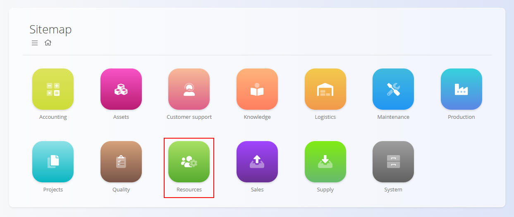
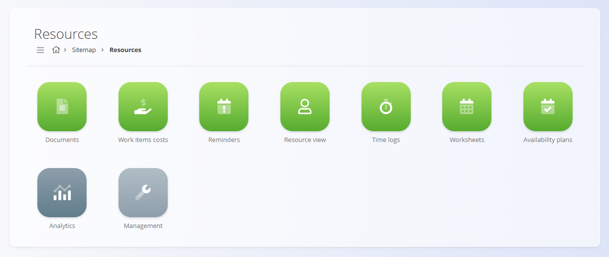
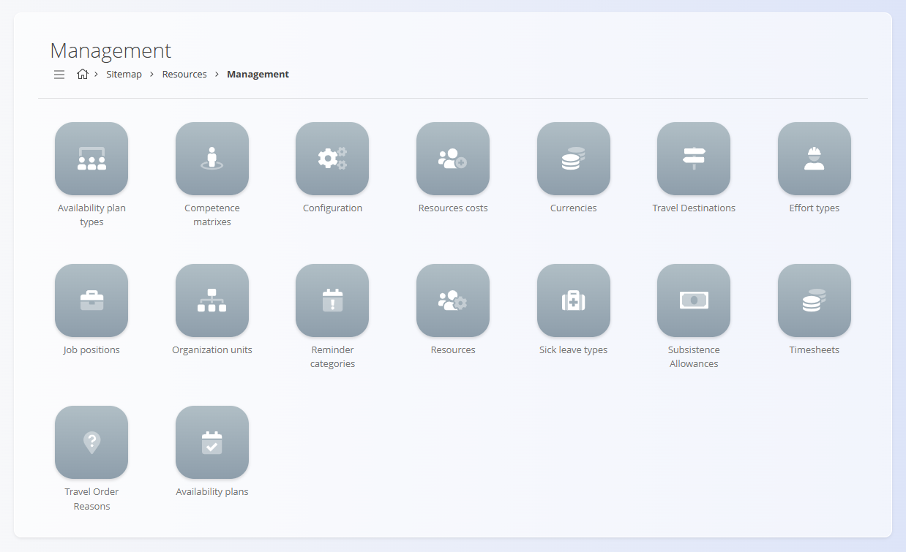
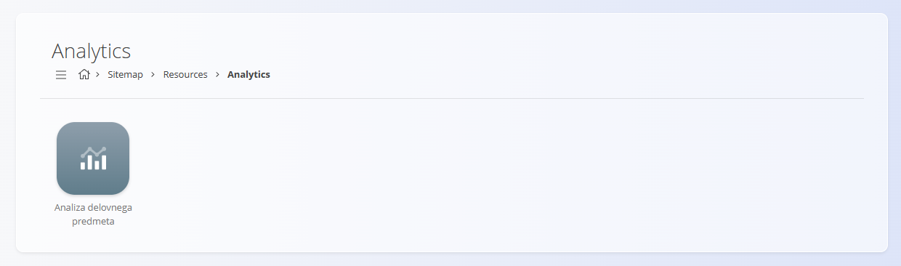

# Resources

The **Resources** domain manages all human-related operational data within your organization. It provides tools for planning availability, tracking time and effort, managing resource master data, and analyzing workforce utilization.

Where other domains (such as **Production**, **Maintenance**, or **Projects**) define *what work needs to be done*, the Resources domain defines *who does the work*, *when*, and *under which conditions*.

To access this domain, navigate to **Resources** in the main navigation.

> [!NOTE]  
> The available features in the Resources domain depend on company configuration, enabled modules, and internal policies.

## What is included in the Resources domain?

The domain is organized into several functional areas:

- [**Documents**](#documents) – resource-related operational documents  
- [**Views**](#views) – day-to-day operational and personal views  
- [**Management**](#management) – configuration and master data  
- [**Analytics**](#analytics) – workforce reporting and analysis  

## Documents

The **Documents** section contains formal resource-related documents used for administrative, legal, or compliance purposes.

Available documents include:

- **[Travel orders](../Documents/TravelOrders.md)**  
  Register, approve, and track employee travel related to work activities, including destinations, dates, and allowances.

Documents typically represent *records* rather than execution workflows.

## Views

The **Views** section contains operational screens used by employees, team leaders, and managers to track work, time, availability, and reminders.

These screens focus on **execution, visibility, and daily tracking**, not configuration.

Available views include:

- **[Work items costs](../Views/WorkItemsCosts.md)**  
  Overview of cost-related data linked to work items and assigned resources.

- **[Reminders](../Views/Reminders.md)**  
  Personal and operational reminders related to tasks, deadlines, or administrative actions.

- **[Resource view](../Views/ResourceView.md)**  
  Overview of resources, their assignments, and availability across time.

- **[Time logs](../Views/TimeLogs.md)**  
  Review and manage time entries recorded by resources.

- **[Worksheets](../Views/Worksheets.md)**  
  Structured time and activity reporting, often used for approvals or payroll processes.

- **[Availability plans](../Views/AvailabilityPlans.md)**  
  Visual representation of planned availability, absences, and working schedules.

## Management

The **Management** section contains configuration screens and master data required for all resource-related processes.

Available configuration and master data include:

- **[Availability plan types](../Management/AvailabilityPlanTypes.md)**  
- **[Availability plans](../Management/AvailabilityPlans.md)**  
- **[Competence matrices](../Management/CompetenceMatrices.md)**  
- **[Configuration](../Management/ResourcesConfiguration.md)**  
- **[Resources costs](../Management/ResourcesCosts.md)**  
- **[Currencies](../../Common/Management/Currencies.md)**  
- **[Travel destinations](../Management/TravelDestinations.md)**  
- **[Travel order reasons](../Management/TravelOrderReasons.md)**  
- **[Effort types](../Management/EffortTypes.md)**  
- **[Job positions](../../Production/Management/JobPositions.md)**  
- **[Organization units](../../Production/Management/OrganizationUnits.md)**  
- **[Reminder categories](../Management/ReminderCategories.md)**  
- **[Resources](../Management/Resources.md)**  
- **[Sick leave types](../Management/SickLeaveTypes.md)**  
- **[Subsistence allowances](../Management/SubsistenceAllowances.md)**  
- **[Timesheets](../Management/Timesheets.md)**  

These elements define how resources are structured, categorized, costed, and reported across the system.

## Analytics

The **Analytics** section provides insight into workforce utilization and operational efficiency.

Available analytical views include:

- **[Work time analysis](../Analytics/WorkTimeAnalysis.md)**  
  Analyze worked hours, absences, availability patterns, and utilization trends.

Analytics screens are **read-only** and support planning, optimization, and decision-making.

## Resources and Other Domains

The Resources domain integrates closely with other operational areas:

| Domain | Integration |
|------|------------|
| **Projects** | Tasks are assigned to resources; effort and availability are tracked per project. |
| **Production** | Resources execute production operations and report time and effort. |
| **Maintenance** | Maintenance activities consume resource time and availability. |
| **Logistics** | Travel orders and availability impact logistics planning. |
| **Accounting** | Time, cost, and allowance data feed financial processes and reporting. |

## Summary

The Resources domain provides the foundation for managing people in operational processes.

It enables:

- structured resource definitions  
- clear availability planning  
- accurate time and effort tracking  
- consistent cost and allowance handling  
- reliable workforce analytics  

By connecting human resources with operational execution, the Resources domain ensures transparency, accountability, and informed decision-making across the organization.

---
