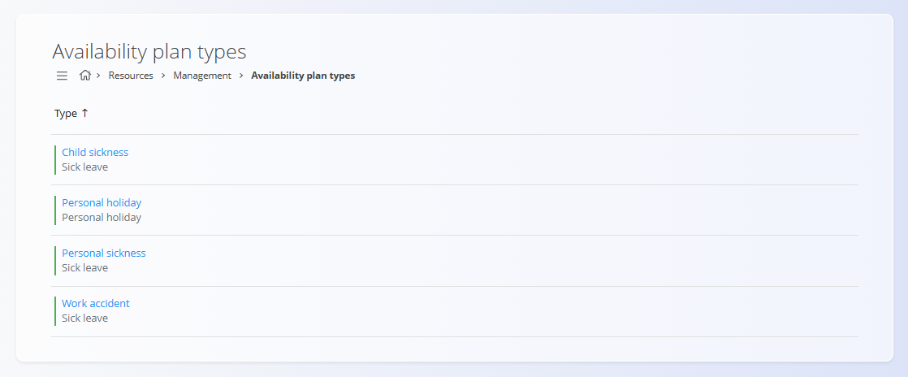

# Availability plan types

Availability plan types define the **categories of availability and absence** that can be assigned to resources. They are used as a foundation for [availability plans](../Views/AvailabilityPlans.md).

To access **Availability plan types**, go to **Resources / Management / Availability plan types** in the [navigation](../../Common/UI/Navigation.md).

## Schema

| Field | Description |
|------|-------------|
| **Type** | Defines the general category of the availability plan. Typical values include **Work**, **Leave**, **Personal holiday**, and **Sick leave**. |
| **Name** | Descriptive name displayed to users when selecting an availability type (for example: *Child sickness*, *Work accident*). |
| **Enabled** | Indicates whether the availability plan type is active and selectable in other parts of the system. |

## List view

The list view shows all configured availability plan types.

For each entry, the following information is visible:

- **Name** – The user-facing name of the availability type
- **Type** – The general category (for example *Work* or *Sick leave*)
- **Status indicator** – Shows whether the type is enabled

Clicking an item in the list opens its **edit screen**.

The **action button** allows creating a new availability plan type.

## Creating and editing availability plan types

Use the **Add availability plan type** form to create or edit an entry.

Changes are applied immediately after saving and affect all screens where availability types are selectable.

## Deletion

Availability plan types can be deleted from the **edit screen**.

Before deletion, the system displays a confirmation dialog:

> *Are you sure you want to delete this record?*

If an availability plan type is already used in availability plans or time records, deletion may be restricted depending on system configuration.

---