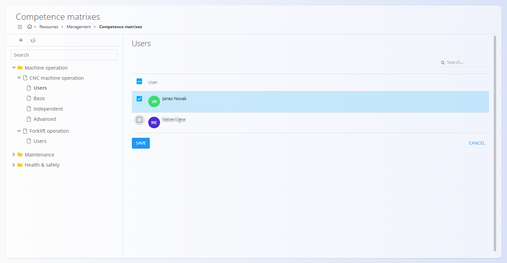
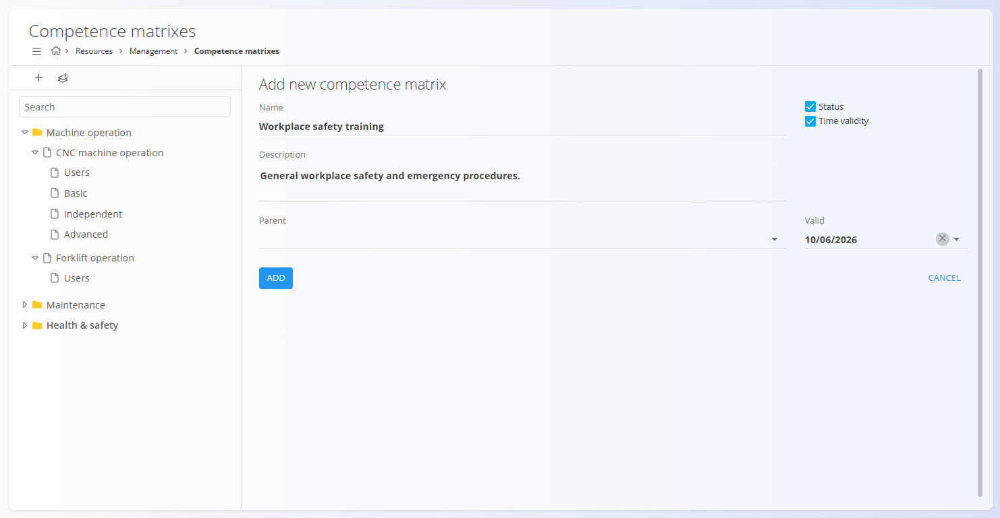

# Competence matrixes

Competence matrixes are used to define, structure, and track employee competences across the organization. They allow you to model skills hierarchically, assign proficiency levels (layers), and link users to specific competences.

To access **Competence matrixes**, go to **Resources / Management / Competence matrixes** in the [**navigation**](../../Common/UI/Navigation.md).

## Schema

| Field | Description |
|------|------------|
| **Name** | Name of the competence or competence group (for example: *Forklift operation*, *Workplace safety training*). |
| **Description** | Optional description explaining the purpose or scope of the competence. |
| **Parent** | Optional parent competence, used to build hierarchical structures (for example grouping competences under *Health & safety*). |
| **Status** | Indicates whether the competence is active and available for use. |
| **Time validity** | When enabled, allows defining a validity date for the competence (for certifications or time-limited training). |
| **Valid until** | Expiration date of the competence when time validity is enabled. |

### Competence matrix layer

| Field | Description |
|------|------------|
| **Name** | Name of the proficiency level (for example: *Basic*, *Independent*, *Advanced*, *Certified operator*). |
| **Level** | Numeric order of the layer. Lower numbers typically represent lower proficiency. |

## Overview

The left side of the screen displays a **tree structure** of all competence matrices. Competences can be organized into categories and sub-competences.

Selecting a competence shows the **Users** view on the right, where users can be assigned to that competence.

## Creating a competence matrix

To create a new competence matrix:

1. Click the **+** button in the top-left toolbar.
2. Enter the **Name** of the competence.
3. Optionally provide a **Description**.
4. (Optional) Select a **Parent** competence to place it in the hierarchy.

   

5. Enable **Status** if the competence should be active.
6. Enable **Time validity** if the competence expires after a certain date.
7. Click **Add** to save.

## Adding layers (proficiency levels)

Layers represent **levels of proficiency** within a competence (for example *Basic*, *Independent*, *Advanced*).

To add a layer:

1. Select an existing competence matrix in the tree.
2. Click the **Add new layer to competence matrix** button in the toolbar.
3. Enter the **Layer name**.
4. Define the **Level** (numeric order).
5. Click **Add** to save.

> [!NOTE]
> Not all competences require layers.
> Layers are typically used where **progression or certification levels** are relevant.

## Assigning users to competences

When a competence is selected, the **Users** panel shows all available users.

- Select one or more users to assign them to the competence.
- Click **Save** to confirm assignments.

Assigned users are now considered competent for that area, optionally at specific proficiency levels if layers are defined.

## Hierarchies and structure

Competence matrices support **nested structures**, allowing you to model real-world skill groupings.

Examples:
- *Health & safety*  
  - Workplace safety training  
  - Emergency procedures
- *Machine operation*  
  - CNC machine operation  
    - Basic  
    - Independent  
    - Advanced
- *Forklift operation*  
  - Certified operator

This structure helps organize competences clearly and makes them easier to manage at scale.

## Deletion

Competence matrices and layers can be deleted from their edit views.

Deleted competences:
- Are removed from the hierarchy
- Are no longer available for user assignment
- Do not affect historical records

> [!WARNING]
> Use deletion carefully, especially when competences are already assigned to users.
