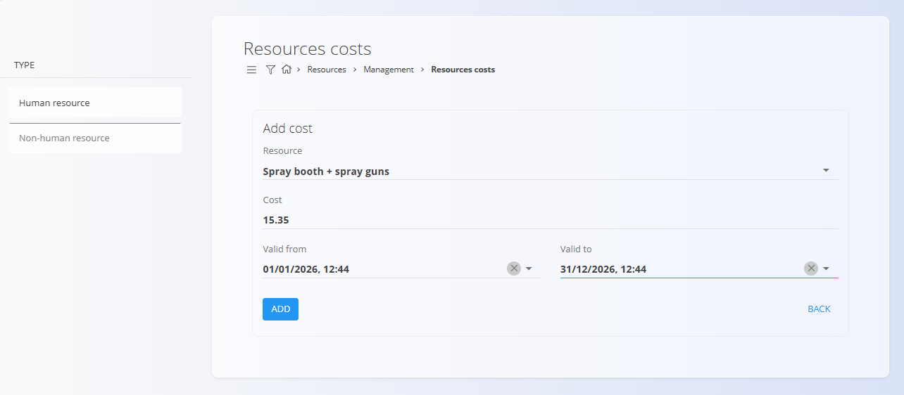
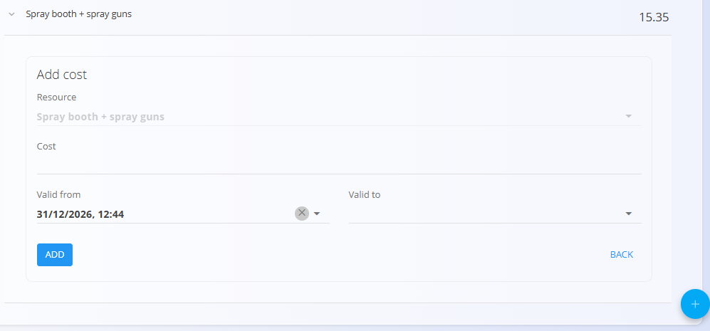

# Resources costs

Define **hourly cost rates for resources** (human and non-human). These costs are used to calculate production/operational costs and to evaluate the cost of performed work.

To access this page, go to **Resources / Management / Resources costs** in the [navigation](../../Common/UI/Navigation.md).

## Schema

| Field | Description |
|------|-------------|
| **Resource** | Resource for which the cost is defined. |
| **Cost (€/h)** | Hourly cost assigned to the resource. |
| **Valid from** | Date and time from which the cost becomes effective. |
| **Valid to** | Date and time until which the cost is valid. If empty, the cost is valid indefinitely. |

## List view

The list shows all resources that have cost definitions. Each line represents a resource.

Expand a resource to view its **cost history** and quick actions.

### Filters

Use filters on the left to narrow down resources:
- **Resource type** — Human resource / Non-human resource

## Actions

### Add new cost entry

Use the [**Action Button**](../../Common/UI/ActionButton.md) to add a new cost entry for a resource. Fill in the fields and click **Add**.

### Add cost

1. Expand a already existing resource and click **Add cost**.
2. Fill in the fields described in the [**Schema**](#schema).
3. Click **Add** to save.

### Edit cost

1. Click the **cost value** in the history list to open it for editing.
2. Adjust the value or validity period and click **Save**.

## Special behaviours / validation

- Validity periods for a given resource must **not overlap**.
- If **Valid to** is not set, the entry is treated as open-ended.
- Cost values are used by analytics and views such as [**Work items costs**](../Views/WorkItemsCosts.md).

## Deletion

Costs can be removed by clicking **Delete** on the edit view.

---

