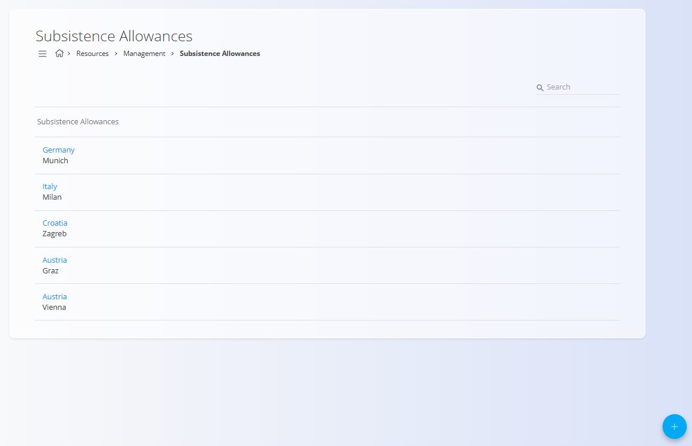

# Subsistence Allowances

Subsistence allowances define the daily amounts paid to employees when traveling for work.
They are typically used in [**Travel orders**](../Documents/TravelOrders.md) to automatically calculate meal and subsistence compensation based on the destination.

To access **Subsistence Allowances**, go to **Resources / Management / Subsistence Allowances** in the [navigation](../../Common/UI/Navigation.md).

## Schema

| Field | Description |
|------|-------------|
| **Country** | Country where the allowance applies. |
| **Postal code** | Optional postal code or city reference (for example: *1010 – Vienna*). |
| **Amount** | Full daily subsistence allowance amount. |
| **Half amount** | Reduced amount, typically used for partial-day travel. |
| **Reduced amount** | Further reduced allowance, depending on company or legal rules. |

## Overview

The **Subsistence Allowances** screen displays a list of all defined allowances.
Each entry represents a country (and optionally a city or postal code) with its corresponding allowance values.

The list supports search and quick navigation.

Clicking on an entry opens it for editing.

## Creating a subsistence allowance

To create a new subsistence allowance:

1. Click [**action button**](../../Common/UI/ActionButton.md).
2. Select the **Country**.
3. Optionally define a **Postal code** or city.
4. Enter the **Amount**, **Half amount**, and **Reduced amount**.
5. Click **Add** to save.

## Editing allowances

Clicking an existing allowance opens it in edit mode, where values can be adjusted as regulations or company policies change.

Changes take effect immediately and are used when calculating allowances in travel-related documents.

## Deletion

Allowances can be deleted from the edit view. To delete an allowance click **Delete** and confirm the action.

## Usage in other modules

Subsistence allowances are primarily used in:

- **[Travel orders](../Documents/TravelOrders.md)** — automatic calculation of daily allowances during business trips

This ensures consistent and centralized management of travel compensation rules across the system.

---